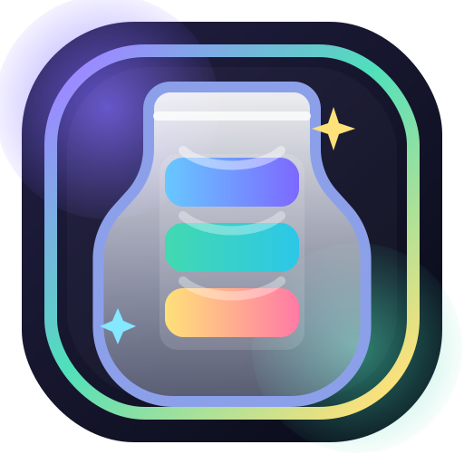

# Prism Pour Full Code Export

이 문서는 현재 프로젝트의 주요 텍스트 파일 전체 코드를 한곳에 모아 둔 내보내기 파일입니다.

## index.html

```html
<!DOCTYPE html>
<html lang="ko">
<head>
  <meta charset="UTF-8">
  <meta
    name="viewport"
    content="width=device-width, initial-scale=1, maximum-scale=1, viewport-fit=cover, interactive-widget=resizes-content"
  >
  <meta name="theme-color" content="#18172b">
  <meta name="background-color" content="#0d1020">
  <meta name="apple-mobile-web-app-capable" content="yes">
  <meta name="apple-mobile-web-app-status-bar-style" content="black-translucent">
  <meta name="apple-mobile-web-app-title" content="Prism Pour">
  <meta
    name="description"
    content="프리미엄 감성의 컬러 플라스크 정렬 퍼즐 게임 Prism Pour"
  >
  <title>Prism Pour</title>
  <link rel="manifest" href="./manifest.json">
  <link rel="apple-touch-icon" href="./assets/icons/apple-touch-icon.png">
  <link rel="icon" type="image/png" sizes="192x192" href="./assets/icons/icon-192.png">
  <link rel="stylesheet" href="./style.css">
</head>
<body data-screen="dashboard">
  <div class="app-shell" id="app-shell">
    <div class="ambient-layer ambient-layer--violet"></div>
    <div class="ambient-layer ambient-layer--mint"></div>
    <div class="ambient-layer ambient-layer--gold"></div>

    <header class="top-frame" id="top-frame">
      <button class="chrome-button" id="global-help-button" type="button">규칙</button>
      <div class="top-frame-brand">
        <span class="top-frame-kicker">Premium Puzzle PWA</span>
        <h1 id="global-brand-name">Prism Pour</h1>
      </div>
      <button class="chrome-button" id="global-settings-button" type="button">설정</button>
    </header>

    <main class="screen-stack">
      <section class="screen is-active" id="dashboard-screen" aria-labelledby="opening-brand">
        <div class="screen-scroll dashboard-scroll">
          <div class="dashboard-shell">
            <article class="hero-shell dashboard-hero">
              <div class="hero-mark-wrap">
                <div class="hero-mark-ring"></div>
                
                <span class="hero-spark hero-spark--one"></span>
                <span class="hero-spark hero-spark--two"></span>
                <span class="hero-spark hero-spark--three"></span>
              </div>

              <div class="hero-copy">
                <p class="eyebrow" id="opening-welcome">반가워요! 오늘도 감각적인 퍼즐 한 판 어떠세요?</p>
                <h2 id="opening-brand">Prism Pour</h2>
                <p class="hero-subcopy" id="opening-tagline">
                  프리즘처럼 빛나는 액체를 정리해, 손끝으로 완성하는 프리미엄 정렬 퍼즐.
                </p>
              </div>

              <div class="hero-progress-card">
                <div class="hero-progress-head">
                  <span>현재 여정</span>
                  <strong id="opening-progress-text">0 / 10 완료</strong>
                </div>
                <div class="progress-track progress-track--hero">
                  <div class="progress-fill" id="opening-progress-fill"></div>
                </div>
                <p class="hero-progress-detail" id="opening-progress-detail">
                  첫 번째 스테이지부터 여유 있게 시작해 보세요.
                </p>
              </div>

              <div class="hero-actions">
                <button class="cta-button cta-button--primary" id="opening-start-button" type="button">
                  바로 시작
                </button>
                <button class="cta-button cta-button--secondary" id="opening-continue-button" type="button" hidden>
                  이어하기
                </button>
                <button class="cta-button cta-button--ghost" id="opening-settings-button" type="button">
                  설정
                </button>
              </div>
            </article>

            <div class="dashboard-grid">
              <div class="dashboard-main">
                <section class="lobby-hero dashboard-summary">
                  <div class="lobby-hero-copy">
                    <p class="eyebrow">Dashboard</p>
                    <h2>오늘 플레이할 퍼즐을 골라보세요</h2>
                    <p id="lobby-progress-detail">
                      난이도와 플라스크 수를 고른 뒤 바로 플레이하거나, 최근 진행 중인 스테이지를 이어서 시작할 수 있습니다.
                    </p>
                  </div>

                  <div class="lobby-hero-stats">
                    <article class="stat-card stat-card--premium">
                      <span class="stat-label">전체 진행률</span>
                      <strong id="overall-progress-text">0 / 10 완료</strong>
                      <div class="progress-track">
                        <div class="progress-fill" id="overall-progress-fill"></div>
                      </div>
                    </article>
                    <article class="stat-card">
                      <span class="stat-label">최근 흐름</span>
                      <strong id="home-progress-summary">초급 0/3 진행 중</strong>
                      <span class="stat-helper" id="home-progress-detail">
                        저장된 이어하기가 있으면 바로 게임 화면으로 이동합니다.
                      </span>
                    </article>
                  </div>

                  <div class="action-row action-row--dashboard">
                    <button class="cta-button cta-button--primary" id="lobby-start-button" type="button">
                      추천 스테이지 시작
                    </button>
                    <button class="cta-button cta-button--secondary" id="lobby-continue-button" type="button" hidden>
                      이어하기
                    </button>
                    <button class="cta-button cta-button--ghost" id="records-button" type="button">
                      클리어 기록
                    </button>
                  </div>
                </section>

                <section class="glass-panel">
                  <div class="panel-head">
                    <h3>난이도 선택</h3>
                    <span id="difficulty-summary">현재 난이도를 선택해 주세요.</span>
                  </div>
                  <div class="chip-group chip-group--wide" id="difficulty-selector"></div>
                </section>

                <section class="glass-panel">
                  <div class="panel-head">
                    <h3>플라스크 개수</h3>
                    <span id="flask-summary">현재 난이도의 전체 구성을 볼 수 있습니다.</span>
                  </div>
                  <div class="chip-group" id="flask-count-selector"></div>
                </section>
              </div>

              <aside class="dashboard-side">
                <section class="glass-panel">
                  <div class="panel-head">
                    <h3>스테이지 선택</h3>
                    <span id="stage-panel-summary">선택한 조건의 스테이지를 확인하세요.</span>
                  </div>
                  <div class="stage-list" id="stage-list"></div>
                </section>
              </aside>
            </div>
          </div>
        </div>
      </section>

      <section class="screen" id="game-screen" aria-labelledby="game-stage-title" hidden>
        <div class="game-shell">
          <header class="game-topbar">
            <button class="chrome-button chrome-button--hud" id="back-lobby-button" type="button">
              대시보드
            </button>

            <div class="game-title-cluster">
              <p class="eyebrow" id="game-stage-path">초급 · 1 / 3</p>
              <h2 id="game-stage-title">Stage</h2>
              <div class="game-progress-inline">
                <strong id="game-progress-text">1 / 10</strong>
                <div class="progress-track progress-track--compact" aria-hidden="true">
                  <div class="progress-fill" id="game-progress-fill"></div>
                </div>
              </div>
            </div>

            <div class="hud-actions">
              <button class="chrome-button chrome-button--hud" id="game-help-button" type="button">규칙</button>
              <button class="chrome-button chrome-button--hud" id="game-settings-button" type="button">설정</button>
            </div>
          </header>

          <section class="game-status-strip" aria-label="현재 플레이 상태">
            <article class="hud-pill game-stat-pill">
              <span class="status-label">이동</span>
              <strong id="move-count">0</strong>
            </article>
            <article class="hud-pill game-stat-pill">
              <span class="status-label">시간</span>
              <strong id="timer-text">00:00</strong>
            </article>
            <article class="hud-pill game-stat-pill">
              <span class="status-label">힌트</span>
              <strong id="hint-count">3</strong>
            </article>
            <article class="hud-pill game-stat-pill game-stat-pill--meta">
              <span class="status-label">보드</span>
              <strong id="board-stage-meta">플라스크 5개 · 색상 3종</strong>
            </article>
          </section>

          <section class="board-shell board-shell--focus">
            <div class="board-grid-wrap" id="board-scroll-area">
              <div class="board-grid" id="board" aria-live="polite"></div>
            </div>
            <p class="sr-only" id="board-caption"></p>
          </section>

          <nav class="control-dock" aria-label="게임 조작">
            <button class="dock-button dock-button--accent" id="hint-button" type="button">힌트</button>
            <button class="dock-button" id="undo-button" type="button">되돌리기</button>
            <button class="dock-button" id="restart-button" type="button">재시작</button>
            <button class="dock-button dock-button--danger" id="give-up-button" type="button">포기</button>
          </nav>

          <div class="notice-banner is-hidden sr-only" id="game-notice" aria-live="polite"></div>
        </div>
      </section>
    </main>
  </div>

  <section class="celebration-overlay" id="celebration-overlay" hidden aria-hidden="true">
    <canvas id="celebration-canvas"></canvas>
  </section>

  <div class="modal-backdrop" id="modal-backdrop" hidden>
    <div class="modal-panel" role="dialog" aria-modal="true" aria-labelledby="modal-title">
      <div class="modal-head">
        <h2 id="modal-title">안내</h2>
        <button class="chrome-button chrome-button--close" id="modal-close-button" type="button" aria-label="닫기">
          닫기
        </button>
      </div>
      <div class="modal-body" id="modal-body"></div>
      <div class="modal-actions" id="modal-actions"></div>
    </div>
  </div>

  <div class="toast" id="toast" hidden></div>

  <section class="tutorial-overlay" id="tutorial-overlay" hidden>
    <div class="tutorial-card">
      <p class="eyebrow" id="tutorial-step-label">Quick Guide</p>
      <h2 id="tutorial-title">Prism Pour의 기본 흐름</h2>
      <p id="tutorial-description">같은 색을 한 플라스크에 모으는 것이 목표입니다.</p>
      <div class="tutorial-dots" id="tutorial-dots" aria-hidden="true"></div>
      <div class="tutorial-actions">
        <button class="cta-button cta-button--ghost" id="tutorial-skip-button" type="button">건너뛰기</button>
        <button class="cta-button cta-button--primary" id="tutorial-next-button" type="button">다음</button>
      </div>
    </div>
  </section>

  <script src="./levels.js"></script>
  <script src="./app.js"></script>
</body>
</html>

```

## style.css

```css
:root {
  /* Design system tokens */
  --app-height: 100dvh;
  --safe-top: env(safe-area-inset-top, 0px);
  --safe-bottom: env(safe-area-inset-bottom, 0px);

  --bg-0: #0d1020;
  --bg-1: #14172d;
  --bg-2: #1e1b39;
  --surface-0: rgba(19, 22, 42, 0.7);
  --surface-1: rgba(27, 32, 59, 0.86);
  --surface-2: rgba(38, 45, 83, 0.92);
  --surface-border: rgba(255, 255, 255, 0.1);
  --surface-soft-border: rgba(255, 255, 255, 0.06);
  --panel-glow: rgba(121, 112, 255, 0.2);

  --text-strong: #f8f8ff;
  --text-main: rgba(244, 247, 255, 0.92);
  --text-soft: rgba(212, 220, 245, 0.72);
  --text-dim: rgba(175, 186, 224, 0.58);

  --accent-violet: #7d68ff;
  --accent-violet-strong: #9481ff;
  --accent-mint: #42d9b0;
  --accent-sun: #ffd96a;
  --accent-rose: #ff7aa6;
  --accent-cyan: #69d2ff;
  --accent-danger: #ff6d83;
  --accent-success: #51d7a0;
  --accent-warning: #ffb66d;

  --glass-highlight: rgba(255, 255, 255, 0.22);
  --glass-rim: rgba(190, 212, 255, 0.44);
  --glass-shadow: 0 24px 48px rgba(0, 0, 0, 0.24);
  --soft-shadow: 0 18px 36px rgba(5, 8, 20, 0.26);
  --ring-shadow: 0 0 0 3px rgba(141, 125, 255, 0.24);

  --radius-2xl: 32px;
  --radius-xl: 24px;
  --radius-lg: 20px;
  --radius-md: 16px;
  --radius-sm: 12px;
  --radius-pill: 999px;

  --motion-scale: 1;
  --top-frame-height: 86px;
  --screen-padding-x: 16px;
  --screen-padding-bottom: calc(18px + var(--safe-bottom));
}

* {
  box-sizing: border-box;
}

html {
  height: 100%;
  overflow: hidden;
  overscroll-behavior: none;
  -webkit-text-size-adjust: 100%;
  text-size-adjust: 100%;
  background: var(--bg-0);
}

body {
  position: fixed;
  inset: 0;
  width: 100%;
  height: var(--app-height);
  margin: 0;
  overflow: hidden;
  overscroll-behavior: none;
  overscroll-behavior-y: none;
  background:
    radial-gradient(circle at 15% 15%, rgba(122, 104, 255, 0.26), transparent 26%),
    radial-gradient(circle at 85% 12%, rgba(79, 217, 171, 0.16), transparent 22%),
    radial-gradient(circle at 72% 82%, rgba(255, 217, 106, 0.12), transparent 22%),
    linear-gradient(180deg, #121526 0%, #0a0d18 100%);
  color: var(--text-main);
  font-family: "Pretendard Variable", "Apple SD Gothic Neo", "Noto Sans KR", "Segoe UI", sans-serif;
  -webkit-user-select: none;
  user-select: none;
  -webkit-touch-callout: none;
  -webkit-tap-highlight-color: transparent;
  touch-action: manipulation;
}

body[data-screen="game"] .top-frame {
  opacity: 0;
  transform: translate3d(0, -20px, 0);
  pointer-events: none;
}

button,
input,
textarea,
select {
  font: inherit;
}

button {
  border: 0;
  padding: 0;
  background: transparent;
  color: inherit;
  cursor: pointer;
  -webkit-tap-highlight-color: transparent;
  touch-action: manipulation;
  user-select: none;
}

img,
svg {
  user-select: none;
  -webkit-user-drag: none;
}

[hidden] {
  display: none !important;
}

.app-shell {
  position: relative;
  width: 100%;
  height: var(--app-height);
  min-height: var(--app-height);
  overflow: hidden;
  isolation: isolate;
}

.ambient-layer {
  position: absolute;
  inset: auto auto 0 0;
  pointer-events: none;
  border-radius: 50%;
  filter: blur(18px);
  opacity: 0.9;
}

.ambient-layer--violet {
  width: 300px;
  height: 300px;
  top: 5%;
  left: -16%;
  background: radial-gradient(circle, rgba(122, 104, 255, 0.3) 0%, transparent 68%);
}

.ambient-layer--mint {
  width: 240px;
  height: 240px;
  top: 18%;
  right: -10%;
  left: auto;
  background: radial-gradient(circle, rgba(66, 217, 176, 0.22) 0%, transparent 68%);
}

.ambient-layer--gold {
  width: 260px;
  height: 260px;
  bottom: -8%;
  right: 6%;
  left: auto;
  background: radial-gradient(circle, rgba(255, 217, 106, 0.14) 0%, transparent 70%);
}

.top-frame {
  position: absolute;
  inset: 0 0 auto;
  z-index: 8;
  display: grid;
  grid-template-columns: auto 1fr auto;
  align-items: center;
  gap: 12px;
  height: calc(var(--top-frame-height) + var(--safe-top));
  padding: calc(10px + var(--safe-top)) var(--screen-padding-x) 10px;
  transition:
    opacity calc(220ms * var(--motion-scale)) ease,
    transform calc(220ms * var(--motion-scale)) ease;
}

.top-frame-brand {
  text-align: center;
}

.top-frame-brand h1 {
  margin: 2px 0 0;
  font-size: 1.08rem;
  letter-spacing: -0.03em;
  color: var(--text-strong);
}

.top-frame-kicker,
.eyebrow {
  display: inline-flex;
  align-items: center;
  gap: 6px;
  margin: 0;
  color: rgba(189, 196, 255, 0.82);
  font-size: 0.74rem;
  font-weight: 800;
  letter-spacing: 0.12em;
  text-transform: uppercase;
}

.screen-stack {
  position: relative;
  height: 100%;
}

.screen {
  position: absolute;
  inset: 0;
  display: none;
  opacity: 0;
  transform: translate3d(0, 16px, 0);
  transition:
    opacity calc(240ms * var(--motion-scale)) ease,
    transform calc(240ms * var(--motion-scale)) ease;
}

.screen.is-active {
  display: block;
  opacity: 1;
  transform: translate3d(0, 0, 0);
}

.screen-scroll {
  height: 100%;
  padding: 8px var(--screen-padding-x) var(--screen-padding-bottom);
  overflow-x: hidden;
  overflow-y: auto;
  overscroll-behavior: contain;
  -webkit-overflow-scrolling: touch;
  scrollbar-width: none;
}

.screen-scroll::-webkit-scrollbar {
  display: none;
}

.opening-scroll,
.lobby-scroll {
  padding-top: calc(var(--top-frame-height) + var(--safe-top) + 8px);
}

.hero-shell,
.glass-panel,
.hud-shell,
.board-shell,
.modal-panel,
.tutorial-card {
  border: 1px solid var(--surface-border);
  background:
    linear-gradient(180deg, rgba(255, 255, 255, 0.08), rgba(255, 255, 255, 0.03)),
    linear-gradient(180deg, rgba(28, 33, 60, 0.94), rgba(17, 21, 42, 0.96));
  box-shadow: var(--glass-shadow);
  backdrop-filter: blur(18px);
}

.hero-shell {
  position: relative;
  padding: 24px 20px 22px;
  border-radius: var(--radius-2xl);
  overflow: hidden;
}

.hero-shell::before {
  content: "";
  position: absolute;
  inset: 0;
  background:
    linear-gradient(135deg, rgba(125, 104, 255, 0.12), transparent 36%),
    linear-gradient(315deg, rgba(66, 217, 176, 0.08), transparent 28%);
  pointer-events: none;
}

.hero-mark-wrap {
  position: relative;
  display: grid;
  place-items: center;
  width: 168px;
  height: 168px;
  margin: 0 auto 18px;
}

.hero-mark-ring {
  position: absolute;
  inset: 0;
  border-radius: 50%;
  background:
    radial-gradient(circle, rgba(255, 255, 255, 0.16) 0%, transparent 52%),
    conic-gradient(from 180deg, rgba(125, 104, 255, 0.5), rgba(66, 217, 176, 0.36), rgba(255, 217, 106, 0.32), rgba(125, 104, 255, 0.5));
  filter: blur(1px);
  animation: pulseRing 5s ease-in-out infinite;
}

.hero-mark {
  position: relative;
  z-index: 1;
  width: 142px;
  height: 142px;
  filter: drop-shadow(0 18px 32px rgba(0, 0, 0, 0.3));
}

.hero-spark {
  position: absolute;
  width: 14px;
  height: 14px;
  border-radius: 50%;
  background: radial-gradient(circle, rgba(255, 255, 255, 0.95), rgba(255, 255, 255, 0));
  animation: driftSpark 4.5s ease-in-out infinite;
}

.hero-spark--one { top: 20px; right: 24px; }
.hero-spark--two { bottom: 26px; left: 18px; animation-delay: -1.6s; }
.hero-spark--three { top: 78px; left: 0; animation-delay: -2.8s; }

.hero-copy {
  position: relative;
  z-index: 1;
  text-align: center;
}

.hero-copy h2 {
  margin: 10px 0 10px;
  font-size: clamp(2.1rem, 8vw, 3.1rem);
  line-height: 1;
  letter-spacing: -0.06em;
  color: var(--text-strong);
}

.hero-subcopy {
  max-width: 30rem;
  margin: 0 auto;
  color: var(--text-soft);
  line-height: 1.7;
}

.hero-progress-card {
  position: relative;
  z-index: 1;
  margin-top: 22px;
  padding: 16px;
  border-radius: 22px;
  background: rgba(255, 255, 255, 0.05);
  border: 1px solid rgba(255, 255, 255, 0.08);
}

.hero-progress-head,
.panel-head,
.action-row,
.hud-top-row,
.hud-progress-copy,
.board-head,
.stage-card-head,
.stage-card-meta,
.stat-card,
.record-row,
.modal-head,
.modal-actions,
.tutorial-actions {
  display: flex;
  align-items: center;
  justify-content: space-between;
  gap: 12px;
}

.hero-progress-head strong,
.stat-card strong,
.hud-progress-copy strong,
.hud-pill strong {
  color: var(--text-strong);
  font-size: 1rem;
}

.hero-progress-detail,
.stat-helper,
.teaser-card p,
.stage-card p,
.modal-copy,
.settings-copy p,
.help-card p,
.record-subcopy {
  margin: 0;
  color: var(--text-soft);
  line-height: 1.6;
}

.hero-actions,
.action-row,
.chip-group,
.hud-actions,
.control-dock,
.modal-actions,
.tutorial-actions {
  display: flex;
  flex-wrap: wrap;
  gap: 10px;
}

.teaser-grid {
  display: grid;
  gap: 12px;
  margin-top: 14px;
}

.teaser-card,
.stat-card,
.stage-card,
.modal-chip,
.help-card,
.record-card,
.setting-card {
  border-radius: 22px;
  border: 1px solid var(--surface-soft-border);
  background: rgba(255, 255, 255, 0.045);
  box-shadow: var(--soft-shadow);
}

.teaser-card {
  padding: 18px;
}

.teaser-label,
.status-label,
.stat-label,
.board-caption,
.stage-card-subtitle,
.mini-label {
  color: var(--text-dim);
  font-size: 0.8rem;
}

.teaser-card h3,
.panel-head h3,
.lobby-hero-copy h2,
.modal-body h3,
.record-card h3,
.help-card h3 {
  margin: 0 0 8px;
  color: var(--text-strong);
  letter-spacing: -0.02em;
}

.lobby-hero {
  display: grid;
  gap: 14px;
}

.lobby-hero-copy h2 {
  font-size: clamp(1.8rem, 7vw, 2.5rem);
}

.lobby-hero-stats {
  display: grid;
  gap: 12px;
}

.stat-card {
  display: grid;
  gap: 10px;
  padding: 16px;
}

.stat-card--premium {
  background:
    linear-gradient(135deg, rgba(125, 104, 255, 0.14), transparent 56%),
    rgba(255, 255, 255, 0.06);
}

.glass-panel {
  margin-top: 14px;
  padding: 18px;
  border-radius: 28px;
}

.panel-head {
  margin-bottom: 14px;
}

.panel-head h3 {
  margin: 0;
}

.panel-head span {
  color: var(--text-soft);
  font-size: 0.86rem;
  text-align: right;
}

.progress-track {
  position: relative;
  width: 100%;
  height: 11px;
  overflow: hidden;
  border-radius: var(--radius-pill);
  background: rgba(255, 255, 255, 0.08);
}

.progress-fill {
  width: 0;
  height: 100%;
  border-radius: inherit;
  background: linear-gradient(90deg, var(--accent-mint), var(--accent-violet-strong), var(--accent-sun));
  box-shadow: 0 0 18px rgba(125, 104, 255, 0.3);
  transition: width calc(260ms * var(--motion-scale)) ease;
}

.progress-track--hero {
  height: 12px;
}

.chip-group {
  gap: 12px;
}

.chip-group--wide {
  gap: 10px;
}

.chip-button,
.chrome-button,
.cta-button,
.dock-button,
.modal-button,
.toggle-button,
.segment-button,
.stage-button {
  min-height: 48px;
  border-radius: 18px;
  transition:
    transform calc(160ms * var(--motion-scale)) ease,
    opacity calc(160ms * var(--motion-scale)) ease,
    background calc(160ms * var(--motion-scale)) ease,
    box-shadow calc(160ms * var(--motion-scale)) ease;
  will-change: transform;
}

.chip-button:active,
.chrome-button:active,
.cta-button:active,
.dock-button:active,
.modal-button:active,
.toggle-button:active,
.segment-button:active,
.stage-button:active {
  transform: translate3d(0, 1px, 0);
}

.chip-button,
.chrome-button,
.cta-button--ghost,
.cta-button--secondary,
.dock-button,
.modal-button,
.toggle-button,
.segment-button,
.stage-button {
  color: var(--text-main);
  border: 1px solid rgba(255, 255, 255, 0.08);
  background: rgba(255, 255, 255, 0.05);
}

.chrome-button {
  padding: 0 14px;
  font-size: 0.88rem;
  font-weight: 700;
  white-space: nowrap;
}

.chrome-button--hud {
  min-width: 64px;
}

.chrome-button--close {
  min-width: auto;
}

.cta-button,
.dock-button,
.modal-button {
  padding: 0 18px;
  font-weight: 800;
}

.cta-button {
  flex: 1 1 140px;
}

.cta-button--primary,
.dock-button--accent,
.modal-button--primary,
.chip-button.is-selected,
.segment-button.is-selected {
  color: #fff;
  border-color: transparent;
  background: linear-gradient(135deg, var(--accent-violet) 0%, #6559ff 42%, #48d5b0 100%);
  box-shadow:
    0 14px 26px rgba(92, 82, 223, 0.32),
    inset 0 1px 0 rgba(255, 255, 255, 0.22);
}

.cta-button--secondary {
  background: linear-gradient(135deg, rgba(255, 255, 255, 0.1), rgba(125, 104, 255, 0.08));
}

.dock-button--danger,
.modal-button--danger {
  background: linear-gradient(135deg, rgba(255, 122, 166, 0.18), rgba(255, 109, 131, 0.08));
  color: #ffb7c7;
}

.chip-button {
  display: inline-flex;
  align-items: center;
  justify-content: center;
  gap: 8px;
  padding: 0 16px;
  color: var(--text-soft);
  font-weight: 700;
}

.chip-button.is-disabled {
  opacity: 0.34;
  pointer-events: none;
}

.stage-list {
  display: grid;
  gap: 12px;
}

.stage-card {
  padding: 16px;
}

.stage-card.is-locked {
  opacity: 0.72;
}

.stage-card-head {
  margin-bottom: 10px;
}

.stage-card-title {
  margin: 0;
  color: var(--text-strong);
  font-size: 1rem;
}

.stage-card-description {
  margin: 0 0 12px;
  color: var(--text-soft);
  line-height: 1.58;
}

.stage-card-meta {
  color: var(--text-dim);
  font-size: 0.85rem;
}

.stage-status {
  padding: 6px 10px;
  border-radius: var(--radius-pill);
  font-size: 0.75rem;
  font-weight: 800;
}

.stage-status.current {
  background: rgba(125, 104, 255, 0.18);
  color: #d9d2ff;
}

.stage-status.cleared {
  background: rgba(66, 217, 176, 0.18);
  color: #c6ffe8;
}

.stage-status.locked {
  background: rgba(255, 255, 255, 0.08);
  color: var(--text-dim);
}

.stage-button {
  width: 100%;
  margin-top: 14px;
  font-weight: 800;
}

.game-shell {
  display: grid;
  grid-template-rows: auto auto minmax(0, 1fr) auto;
  gap: 12px;
  height: 100%;
  padding: calc(var(--safe-top) + 6px) var(--screen-padding-x) var(--screen-padding-bottom);
  overflow: hidden;
  overscroll-behavior: none;
}

.hud-shell {
  padding: 16px;
  border-radius: 26px;
}

.hud-top-row {
  align-items: flex-start;
}

.hud-title-wrap {
  min-width: 0;
  flex: 1 1 auto;
  text-align: center;
}

.hud-title-wrap h2 {
  margin: 8px 0 0;
  color: var(--text-strong);
  font-size: 1.28rem;
  letter-spacing: -0.04em;
}

.hud-actions {
  justify-content: flex-end;
}

.hud-progress {
  display: grid;
  gap: 8px;
  margin-top: 14px;
}

.hud-progress-copy span {
  color: var(--text-dim);
  font-size: 0.82rem;
}

.hud-stats {
  display: grid;
  grid-template-columns: repeat(3, minmax(0, 1fr));
  gap: 10px;
  margin-top: 14px;
}

.hud-pill {
  display: grid;
  gap: 5px;
  min-width: 0;
  padding: 12px;
  border-radius: 18px;
  background: rgba(255, 255, 255, 0.05);
  border: 1px solid rgba(255, 255, 255, 0.08);
}

.notice-banner {
  padding: 14px 16px;
  border-radius: 18px;
  font-weight: 700;
  background: linear-gradient(135deg, rgba(79, 213, 176, 0.94), rgba(125, 104, 255, 0.92));
  color: #fff;
  box-shadow: 0 14px 24px rgba(0, 0, 0, 0.18);
}

.notice-banner.warning {
  background: linear-gradient(135deg, rgba(255, 182, 109, 0.94), rgba(255, 128, 118, 0.94));
}

.notice-banner.danger {
  background: linear-gradient(135deg, rgba(255, 122, 166, 0.94), rgba(255, 109, 131, 0.94));
}

.notice-banner.is-hidden {
  display: none;
}

.board-shell {
  display: flex;
  flex-direction: column;
  min-height: 0;
  padding: 16px 14px 14px;
  border-radius: 30px;
  overflow: hidden;
  transform: translateZ(0);
}

.board-head {
  align-items: flex-start;
  margin-bottom: 12px;
}

.board-caption {
  line-height: 1.5;
}

.board-caption--meta {
  text-align: right;
}

.board-grid-wrap {
  flex: 1 1 auto;
  min-height: 0;
  overflow: hidden;
  overscroll-behavior: none;
  touch-action: none;
  -webkit-tap-highlight-color: transparent;
}

.board-grid {
  display: grid;
  grid-template-columns: repeat(5, minmax(0, 1fr));
  gap: var(--board-gap-y, 12px) var(--board-gap-x, 10px);
  height: 100%;
  align-content: center;
  justify-items: center;
  touch-action: none;
  contain: layout paint;
}

.board-grid.board-5 { --tube-width: 68px; --tube-height: 194px; }
.board-grid.board-10 { --tube-width: 62px; --tube-height: 170px; }
.board-grid.board-15 { --tube-width: 55px; --tube-height: 148px; --board-gap-y: 10px; --board-gap-x: 8px; }
.board-grid.board-20 { --tube-width: 48px; --tube-height: 122px; --board-gap-y: 8px; --board-gap-x: 6px; }

.tube {
  position: relative;
  width: min(100%, var(--tube-width));
  height: var(--tube-height);
  border-radius: 28px;
  transform: translate3d(0, 0, 0);
  transition:
    transform calc(180ms * var(--motion-scale)) ease,
    filter calc(180ms * var(--motion-scale)) ease;
  will-change: transform;
}

.tube::before {
  content: "";
  position: absolute;
  inset: 6px 8px 8px;
  border-radius: 24px 24px 18px 18px;
  background:
    linear-gradient(180deg, rgba(255, 255, 255, 0.18), rgba(225, 236, 255, 0.06)),
    linear-gradient(180deg, rgba(38, 48, 92, 0.34), rgba(15, 18, 34, 0.28));
  border: 2px solid var(--glass-rim);
  box-shadow:
    inset 0 1px 0 rgba(255, 255, 255, 0.28),
    inset 0 -16px 22px rgba(3, 6, 18, 0.16),
    0 18px 26px rgba(4, 6, 16, 0.24);
}

.tube::after {
  content: "";
  position: absolute;
  left: 50%;
  top: 10px;
  width: calc(100% - 28px);
  height: 11px;
  transform: translateX(-50%);
  border-radius: var(--radius-pill);
  background: linear-gradient(180deg, rgba(255, 255, 255, 0.86), rgba(218, 230, 255, 0.36));
  opacity: 0.95;
}

.tube-button {
  position: relative;
  width: 100%;
  height: 100%;
  border-radius: inherit;
  overflow: visible;
  outline: none;
  background: transparent;
  appearance: none;
  touch-action: none;
  -webkit-tap-highlight-color: transparent;
}

.tube-button:focus-visible {
  box-shadow: var(--ring-shadow);
}

.tube-index,
.tube-badge {
  position: absolute;
  left: 50%;
  transform: translateX(-50%);
  z-index: 2;
}

.tube-index {
  top: 16px;
  color: rgba(241, 246, 255, 0.66);
  font-size: 0.72rem;
  font-weight: 800;
}

.tube-badge {
  top: 38px;
  padding: 5px 10px;
  border-radius: var(--radius-pill);
  background: linear-gradient(135deg, rgba(66, 217, 176, 0.18), rgba(125, 104, 255, 0.18));
  color: #dffff5;
  font-size: 0.7rem;
  font-weight: 800;
  opacity: 0;
  transition:
    opacity calc(180ms * var(--motion-scale)) ease,
    transform calc(180ms * var(--motion-scale)) ease;
}

.tube-stack {
  position: absolute;
  inset: 56px 16px 16px;
  display: flex;
  flex-direction: column-reverse;
  gap: 4px;
}

.tube-slot,
.liquid-layer {
  flex: 1 1 0;
  border-radius: 13px;
}

.tube-slot {
  border: 1px dashed rgba(255, 255, 255, 0.06);
  background: rgba(255, 255, 255, 0.025);
}

.liquid-layer {
  position: relative;
  overflow: hidden;
}

.liquid-layer::before {
  content: "";
  position: absolute;
  inset: 0;
  background:
    linear-gradient(180deg, rgba(255, 255, 255, 0.22), transparent 44%),
    radial-gradient(circle at 22% 28%, rgba(255, 255, 255, 0.24), transparent 36%);
}

.tube.is-selected {
  filter: drop-shadow(0 0 24px rgba(125, 104, 255, 0.3));
  transform: translate3d(0, -10px, 0);
}

.tube.is-selected::before {
  border-color: rgba(174, 165, 255, 0.84);
  box-shadow:
    inset 0 1px 0 rgba(255, 255, 255, 0.36),
    inset 0 -16px 22px rgba(3, 6, 18, 0.18),
    0 0 0 4px rgba(125, 104, 255, 0.18),
    0 18px 26px rgba(4, 6, 16, 0.24);
}

.tube.is-valid-target::before {
  border-color: rgba(77, 226, 185, 0.88);
  box-shadow:
    inset 0 1px 0 rgba(255, 255, 255, 0.32),
    0 0 0 3px rgba(66, 217, 176, 0.14),
    0 0 18px rgba(66, 217, 176, 0.18);
}

.tube.is-hint-source::before,
.tube.is-pour-source::before {
  box-shadow:
    inset 0 1px 0 rgba(255, 255, 255, 0.34),
    0 0 0 4px rgba(125, 104, 255, 0.14),
    0 0 22px rgba(125, 104, 255, 0.22);
}

.tube.is-hint-target::before,
.tube.is-pour-target::before {
  box-shadow:
    inset 0 1px 0 rgba(255, 255, 255, 0.34),
    0 0 0 4px rgba(66, 217, 176, 0.14),
    0 0 24px rgba(66, 217, 176, 0.22);
}

.tube.is-complete::before {
  border-color: rgba(92, 237, 182, 0.86);
  box-shadow:
    inset 0 1px 0 rgba(255, 255, 255, 0.38),
    0 0 0 4px rgba(66, 217, 176, 0.12),
    0 0 28px rgba(66, 217, 176, 0.24);
}

.tube.is-complete .tube-badge {
  opacity: 1;
  transform: translate(-50%, 0);
}

.tube.is-invalid {
  animation: shakeTube calc(360ms * var(--motion-scale)) ease;
}

.control-dock {
  position: relative;
  z-index: 4;
  padding: 10px 0 0;
}

.dock-button {
  flex: 1 1 calc(50% - 10px);
  padding: 0 14px;
}

.modal-backdrop,
.tutorial-overlay,
.celebration-overlay {
  position: fixed;
  inset: 0;
}

.celebration-overlay {
  z-index: 18;
  pointer-events: none;
}

#celebration-canvas {
  display: block;
  width: 100%;
  height: 100%;
}

.modal-backdrop,
.tutorial-overlay {
  z-index: 24;
  display: grid;
  place-items: center;
  padding: 16px;
  background: rgba(7, 10, 20, 0.62);
  backdrop-filter: blur(18px);
}

.modal-panel,
.tutorial-card {
  width: min(100%, 520px);
  max-height: min(86vh, 760px);
  overflow: auto;
  border-radius: 28px;
}

.modal-panel {
  padding-bottom: 18px;
}

.modal-head {
  position: sticky;
  top: 0;
  padding: 18px 18px 12px;
  background: linear-gradient(180deg, rgba(17, 21, 42, 0.98), rgba(17, 21, 42, 0.9));
  border-bottom: 1px solid rgba(255, 255, 255, 0.06);
}

.modal-head h2 {
  margin: 0;
  color: var(--text-strong);
  font-size: 1.12rem;
}

.modal-body {
  padding: 18px;
}

.modal-actions {
  padding: 0 18px;
}

.modal-button {
  flex: 1 1 138px;
}

.modal-copy,
.record-subcopy {
  color: var(--text-soft);
}

.modal-stack,
.help-list,
.settings-list,
.record-list {
  display: grid;
  gap: 12px;
}

.modal-chip,
.help-card,
.record-card,
.setting-card {
  padding: 16px;
}

.setting-card {
  display: grid;
  gap: 14px;
}

.settings-row {
  display: flex;
  align-items: center;
  justify-content: space-between;
  gap: 14px;
}

.settings-copy h3,
.help-card h3,
.record-card h3 {
  margin: 0 0 6px;
}

.toggle-button {
  min-width: 82px;
  padding: 0 12px;
  font-weight: 800;
}

.toggle-button.is-on {
  color: #fff;
  background: linear-gradient(135deg, rgba(66, 217, 176, 0.82), rgba(125, 104, 255, 0.8));
}

.segmented {
  display: inline-flex;
  gap: 6px;
  padding: 4px;
  border-radius: var(--radius-pill);
  background: rgba(255, 255, 255, 0.06);
}

.segment-button {
  min-width: 72px;
  padding: 0 12px;
  color: var(--text-soft);
  font-weight: 800;
}

.record-row {
  padding: 12px 0;
  border-bottom: 1px solid rgba(255, 255, 255, 0.06);
}

.record-row:last-child {
  border-bottom: 0;
  padding-bottom: 0;
}

.record-badge {
  padding: 5px 10px;
  border-radius: var(--radius-pill);
  background: rgba(255, 255, 255, 0.08);
  color: var(--text-soft);
  font-size: 0.72rem;
  font-weight: 800;
}

.record-badge.complete {
  background: rgba(66, 217, 176, 0.16);
  color: #ddfff2;
}

.record-badge.locked {
  color: var(--text-dim);
}

.toast {
  position: fixed;
  left: 50%;
  bottom: calc(24px + var(--safe-bottom));
  z-index: 30;
  min-width: min(88vw, 320px);
  padding: 14px 18px;
  border-radius: 18px;
  background: rgba(16, 19, 37, 0.94);
  border: 1px solid rgba(255, 255, 255, 0.08);
  color: var(--text-strong);
  box-shadow: var(--glass-shadow);
  transform: translate3d(-50%, 16px, 0);
  opacity: 0;
  transition:
    transform calc(200ms * var(--motion-scale)) ease,
    opacity calc(200ms * var(--motion-scale)) ease;
}

.toast.is-visible {
  opacity: 1;
  transform: translate3d(-50%, 0, 0);
}

.tutorial-card {
  padding: 22px 20px;
}

.tutorial-card h2 {
  margin: 10px 0;
  color: var(--text-strong);
  letter-spacing: -0.03em;
}

.tutorial-card p {
  margin: 0;
  color: var(--text-soft);
  line-height: 1.65;
}

.tutorial-dots {
  display: flex;
  gap: 8px;
  margin: 18px 0;
}

.tutorial-dot {
  width: 10px;
  height: 10px;
  border-radius: 50%;
  background: rgba(255, 255, 255, 0.16);
}

.tutorial-dot.is-active {
  width: 28px;
  border-radius: var(--radius-pill);
  background: linear-gradient(90deg, var(--accent-mint), var(--accent-violet-strong));
}

.sr-only {
  position: absolute;
  width: 1px;
  height: 1px;
  padding: 0;
  margin: -1px;
  overflow: hidden;
  clip: rect(0, 0, 0, 0);
  border: 0;
}

@keyframes pulseRing {
  0%,
  100% {
    transform: scale(0.98);
    opacity: 0.92;
  }
  50% {
    transform: scale(1.03);
    opacity: 1;
  }
}

@keyframes driftSpark {
  0%,
  100% {
    transform: translate3d(0, 0, 0) scale(1);
    opacity: 0.6;
  }
  50% {
    transform: translate3d(0, -8px, 0) scale(1.15);
    opacity: 1;
  }
}

@keyframes shakeTube {
  0%,
  100% { transform: translate3d(0, 0, 0); }
  20% { transform: translate3d(-4px, 0, 0); }
  40% { transform: translate3d(4px, 0, 0); }
  60% { transform: translate3d(-3px, 0, 0); }
  80% { transform: translate3d(3px, 0, 0); }
}

@media (min-width: 620px) {
  :root {
    --screen-padding-x: 20px;
  }

  .screen-scroll {
    width: min(100%, 880px);
    margin: 0 auto;
  }

  .lobby-hero-stats,
  .teaser-grid {
    grid-template-columns: repeat(3, minmax(0, 1fr));
  }

  .glass-panel {
    padding: 20px;
  }

  .game-shell {
    width: min(100%, 920px);
    margin: 0 auto;
  }

  .board-grid.board-5 { --tube-width: 82px; --tube-height: 220px; }
  .board-grid.board-10 { --tube-width: 76px; --tube-height: 198px; }
  .board-grid.board-15 { --tube-width: 66px; --tube-height: 170px; --board-gap-y: 12px; --board-gap-x: 10px; }
  .board-grid.board-20 { --tube-width: 58px; --tube-height: 144px; --board-gap-y: 10px; --board-gap-x: 8px; }
}

@media (max-width: 420px) {
  :root {
    --screen-padding-x: 14px;
  }

  .hero-shell {
    padding-inline: 18px;
  }

  .board-grid.board-5 { --tube-width: 60px; --tube-height: 176px; }
  .board-grid.board-10 { --tube-width: 56px; --tube-height: 156px; }
  .board-grid.board-15 { --tube-width: 49px; --tube-height: 134px; --board-gap-y: 8px; --board-gap-x: 6px; }
  .board-grid.board-20 { --tube-width: 42px; --tube-height: 108px; --board-gap-y: 6px; --board-gap-x: 5px; }

  .hud-top-row {
    gap: 8px;
  }

  .chrome-button--hud {
    min-width: 56px;
    padding-inline: 10px;
  }

  .hud-pill {
    padding-inline: 10px;
  }
}

/* Dashboard / Game split refinements */
.dashboard-scroll {
  padding-top: calc(var(--top-frame-height) + var(--safe-top) + 10px);
}

.dashboard-shell {
  display: grid;
  gap: 18px;
  padding-bottom: 10px;
}

.dashboard-grid {
  display: grid;
  gap: 16px;
}

.dashboard-main,
.dashboard-side {
  display: grid;
  gap: 16px;
  align-content: start;
}

.dashboard-hero {
  padding-bottom: 24px;
}

.dashboard-summary {
  display: grid;
  gap: 16px;
  padding: 22px 20px;
  border-radius: var(--radius-2xl);
  border: 1px solid rgba(255, 255, 255, 0.08);
  background:
    linear-gradient(180deg, rgba(255, 255, 255, 0.05), rgba(255, 255, 255, 0.02)),
    linear-gradient(180deg, rgba(20, 25, 47, 0.92), rgba(13, 17, 35, 0.95));
  box-shadow: var(--glass-shadow);
}

.action-row--dashboard {
  margin-top: 2px;
}

body[data-screen="game"] {
  background:
    radial-gradient(circle at 50% 12%, rgba(123, 105, 255, 0.16), transparent 24%),
    radial-gradient(circle at 84% 18%, rgba(48, 207, 156, 0.1), transparent 22%),
    linear-gradient(180deg, #0a0d17 0%, #060810 100%);
}

body[data-screen="game"] .ambient-layer {
  opacity: 0.42;
  filter: blur(24px);
}

.game-shell {
  gap: 10px;
  padding: calc(var(--safe-top) + 8px) 10px var(--screen-padding-bottom);
}

.game-topbar,
.game-status-strip {
  position: relative;
  z-index: 4;
}

.game-topbar {
  display: grid;
  grid-template-columns: auto 1fr auto;
  align-items: center;
  gap: 10px;
  padding: 12px 14px;
  border-radius: 26px;
  border: 1px solid rgba(255, 255, 255, 0.08);
  background:
    linear-gradient(180deg, rgba(255, 255, 255, 0.06), rgba(255, 255, 255, 0.02)),
    linear-gradient(180deg, rgba(17, 21, 41, 0.92), rgba(11, 14, 28, 0.95));
  box-shadow: 0 18px 32px rgba(0, 0, 0, 0.24);
}

.game-title-cluster {
  min-width: 0;
  display: grid;
  gap: 4px;
  text-align: center;
}

.game-title-cluster h2 {
  margin: 0;
  color: var(--text-strong);
  font-size: 1.18rem;
  letter-spacing: -0.04em;
}

.game-progress-inline {
  display: grid;
  gap: 6px;
  justify-items: center;
}

.game-progress-inline strong {
  color: rgba(234, 240, 255, 0.78);
  font-size: 0.76rem;
  font-weight: 800;
}

.progress-track--compact {
  width: min(100%, 140px);
  height: 6px;
}

.game-status-strip {
  display: grid;
  grid-template-columns: repeat(3, minmax(0, 1fr));
  gap: 8px;
}

.game-stat-pill {
  padding: 10px 12px;
  gap: 4px;
}

.game-stat-pill strong {
  color: var(--text-strong);
  font-size: 0.98rem;
}

.game-stat-pill--meta {
  grid-column: 1 / -1;
  text-align: center;
}

.game-stat-pill--meta strong {
  font-size: 0.84rem;
  line-height: 1.35;
}

.board-shell--focus {
  position: relative;
  display: flex;
  flex-direction: column;
  flex: 1 1 auto;
  min-height: 0;
  padding: 10px 10px 12px;
  border-radius: 34px;
  background:
    linear-gradient(180deg, rgba(255, 255, 255, 0.05), rgba(255, 255, 255, 0.015)),
    linear-gradient(180deg, rgba(13, 17, 34, 0.98), rgba(8, 10, 22, 0.98));
  box-shadow:
    inset 0 1px 0 rgba(255, 255, 255, 0.05),
    0 30px 44px rgba(0, 0, 0, 0.28);
}

.board-shell--focus::before,
.board-shell--focus::after {
  content: "";
  position: absolute;
  left: 10px;
  right: 10px;
  height: 18px;
  pointer-events: none;
  z-index: 2;
}

.board-shell--focus::before {
  top: 10px;
  background: linear-gradient(180deg, rgba(8, 10, 22, 0.94), rgba(8, 10, 22, 0));
}

.board-shell--focus::after {
  bottom: 12px;
  background: linear-gradient(0deg, rgba(8, 10, 22, 0.94), rgba(8, 10, 22, 0));
}

.board-shell--focus .board-grid-wrap {
  flex: 1 1 auto;
  min-height: 0;
  overflow-x: hidden;
  overflow-y: auto;
  overscroll-behavior: contain;
  -webkit-overflow-scrolling: touch;
  scrollbar-width: none;
  touch-action: pan-y;
  padding: 6px 2px 18px;
}

.board-shell--focus .board-grid-wrap::-webkit-scrollbar {
  width: 0;
  height: 0;
}

.board-shell--focus .board-grid {
  height: auto;
  min-height: 100%;
  align-content: start;
  padding-block: 4px 10px;
  touch-action: pan-y;
}

.board-shell--focus .board-grid.board-5,
.board-shell--focus .board-grid.board-10 {
  align-content: center;
}

.board-grid.board-5 { --tube-width: 74px; --tube-height: 214px; }
.board-grid.board-10 { --tube-width: 68px; --tube-height: 190px; }
.board-grid.board-15 { --tube-width: 60px; --tube-height: 166px; --board-gap-y: 10px; --board-gap-x: 8px; }
.board-grid.board-20 { --tube-width: 52px; --tube-height: 136px; --board-gap-y: 8px; --board-gap-x: 6px; }

.tube-stack {
  inset: 56px 14px 14px;
  gap: 5px;
}

.tube-slot,
.liquid-layer {
  border-radius: 14px;
}

.tube-slot {
  border: 1px dashed rgba(255, 255, 255, 0.08);
  background: rgba(255, 255, 255, 0.03);
}

.liquid-layer {
  border: 1px solid rgba(255, 255, 255, 0.18);
  box-shadow:
    inset 0 1px 0 rgba(255, 255, 255, 0.2),
    inset 0 -10px 16px rgba(0, 0, 0, 0.12),
    0 8px 14px rgba(0, 0, 0, 0.12);
}

.liquid-layer::before {
  background:
    linear-gradient(180deg, rgba(255, 255, 255, 0.28), rgba(255, 255, 255, 0.04) 46%, transparent 78%),
    radial-gradient(circle at 22% 24%, rgba(255, 255, 255, 0.26), transparent 34%);
}

.board-shell--focus .tube-button {
  touch-action: manipulation;
}

.control-dock {
  display: grid;
  grid-template-columns: repeat(4, minmax(0, 1fr));
  gap: 10px;
  padding-top: 2px;
}

.dock-button {
  min-width: 0;
}

body[data-screen="game"] .toast {
  display: none !important;
}

@media (min-width: 820px) {
  .dashboard-scroll {
    width: min(100%, 1120px);
  }

  .dashboard-grid {
    grid-template-columns: minmax(0, 1.08fr) minmax(320px, 0.92fr);
    align-items: start;
  }

  .game-shell {
    width: min(100%, 980px);
    padding-inline: 16px;
  }

  .game-status-strip {
    grid-template-columns: repeat(4, minmax(0, 1fr));
  }

  .game-stat-pill--meta {
    grid-column: auto;
  }

  .board-grid.board-5 { --tube-width: 84px; --tube-height: 228px; }
  .board-grid.board-10 { --tube-width: 78px; --tube-height: 204px; }
  .board-grid.board-15 { --tube-width: 70px; --tube-height: 184px; }
  .board-grid.board-20 { --tube-width: 60px; --tube-height: 152px; --board-gap-y: 10px; --board-gap-x: 8px; }
}

@media (max-width: 480px) {
  .game-topbar {
    padding: 10px 12px;
  }

  .game-title-cluster h2 {
    font-size: 1.08rem;
  }

  .progress-track--compact {
    width: 110px;
  }

  .control-dock {
    gap: 8px;
  }

  .board-grid.board-5 { --tube-width: 66px; --tube-height: 196px; }
  .board-grid.board-10 { --tube-width: 60px; --tube-height: 172px; }
  .board-grid.board-15 { --tube-width: 53px; --tube-height: 148px; --board-gap-y: 8px; --board-gap-x: 6px; }
  .board-grid.board-20 { --tube-width: 46px; --tube-height: 122px; --board-gap-y: 6px; --board-gap-x: 5px; }
}

@media (prefers-reduced-motion: reduce) {
  :root {
    --motion-scale: 0;
  }
}

```

## app.js

```javascript
(function () {
  "use strict";

  if (!window.COLOR_FLASK_DATA) {
    return;
  }

  // Global app data and persistent runtime state.
  var APP_DATA = window.COLOR_FLASK_DATA;
  var STORAGE_KEY = "prism-pour-save-v2";
  var DEFAULT_SETTINGS = {
    haptics: true,
    bgm: true,
    sfx: true,
    motion: "standard"
  };
  var MOTION_SCALE_MAP = {
    calm: 0.86,
    standard: 1,
    vivid: 1.12
  };
  var TUTORIAL_STEPS = [
    {
      label: "Quick Guide",
      title: "먼저 출발 플라스크를 누르고, 목적지 플라스크를 눌러 옮기세요.",
      description: "선택된 플라스크는 떠오르고, 이동 가능한 대상은 은은한 민트 링으로 표시됩니다."
    },
    {
      label: "Rule",
      title: "맨 위에 이어진 같은 색 블록만 한 번에 이동할 수 있어요.",
      description: "도착 플라스크는 비어 있거나 같은 색 위여야 하고, 전체 블록이 들어갈 공간도 충분해야 합니다."
    },
    {
      label: "Assist",
      title: "힌트는 실제 해결 경로에서 다음 수를 찾아 추천합니다.",
      description: "되돌리기와 재시작, 햅틱과 사운드 설정까지 모두 모바일 플레이 기준으로 조정할 수 있습니다."
    }
  ];

  var stageMap = {};
  var difficultyMap = {};
  var solverColorMap = {};
  var state = {
    screen: "dashboard",
    selectedDifficulty: APP_DATA.difficulties[0].key,
    selectedFlaskCount: "all",
    settings: cloneObject(DEFAULT_SETTINGS),
    results: {},
    currentRun: null,
    selectedTubeIndex: null,
    validTargets: [],
    invalidTubes: [],
    recentMove: null,
    modal: null,
    notice: null,
    tutorialOpen: false,
    tutorialStep: 0,
    hasSeenTutorial: false,
    solvingHint: false,
    hintRequestId: 0,
    timerStartedAt: 0,
    timerId: 0,
    toastId: 0,
    toastHideId: 0,
    noticeId: 0,
    interactionUnlocked: false,
    storageWarned: false
  };
  var els = {};
  var audioEngine = null;
  var celebration = null;

  // Boot sequence: restore state, wire UI, then render the current screen.
  buildLookupTables();
  cacheElements();
  loadState();
  updateViewportMetrics();
  applyBranding();
  applySettings();
  audioEngine = createAudioEngine();
  celebration = createCelebrationController();
  bindEvents();
  registerServiceWorker();
  renderCurrentScreen();

  function buildLookupTables() {
    var paletteKeys = Object.keys(APP_DATA.palette);

    APP_DATA.stages.forEach(function (stage) {
      stageMap[stage.id] = stage;
    });

    APP_DATA.difficulties.forEach(function (difficulty) {
      difficultyMap[difficulty.key] = difficulty;
    });

    paletteKeys.forEach(function (key, index) {
      solverColorMap[key] = String.fromCharCode(65 + index);
    });
  }

  function cacheElements() {
    els.appShell = document.getElementById("app-shell");
    els.topFrame = document.getElementById("top-frame");
    els.dashboardScreen = document.getElementById("dashboard-screen");
    els.globalBrandName = document.getElementById("global-brand-name");
    els.globalHelpButton = document.getElementById("global-help-button");
    els.globalSettingsButton = document.getElementById("global-settings-button");

    els.openingBrand = document.getElementById("opening-brand");
    els.openingWelcome = document.getElementById("opening-welcome");
    els.openingTagline = document.getElementById("opening-tagline");
    els.openingProgressText = document.getElementById("opening-progress-text");
    els.openingProgressFill = document.getElementById("opening-progress-fill");
    els.openingProgressDetail = document.getElementById("opening-progress-detail");
    els.openingStartButton = document.getElementById("opening-start-button");
    els.openingContinueButton = document.getElementById("opening-continue-button");
    els.openingSettingsButton = document.getElementById("opening-settings-button");

    els.overallProgressText = document.getElementById("overall-progress-text");
    els.overallProgressFill = document.getElementById("overall-progress-fill");
    els.homeProgressSummary = document.getElementById("home-progress-summary");
    els.homeProgressDetail = document.getElementById("home-progress-detail");
    els.difficultySummary = document.getElementById("difficulty-summary");
    els.flaskSummary = document.getElementById("flask-summary");
    els.difficultySelector = document.getElementById("difficulty-selector");
    els.flaskCountSelector = document.getElementById("flask-count-selector");
    els.lobbyStartButton = document.getElementById("lobby-start-button");
    els.lobbyContinueButton = document.getElementById("lobby-continue-button");
    els.recordsButton = document.getElementById("records-button");
    els.stagePanelSummary = document.getElementById("stage-panel-summary");
    els.stageList = document.getElementById("stage-list");

    els.gameScreen = document.getElementById("game-screen");
    els.backLobbyButton = document.getElementById("back-lobby-button");
    els.gameHelpButton = document.getElementById("game-help-button");
    els.gameSettingsButton = document.getElementById("game-settings-button");
    els.gameStagePath = document.getElementById("game-stage-path");
    els.gameStageTitle = document.getElementById("game-stage-title");
    els.gameProgressText = document.getElementById("game-progress-text");
    els.gameProgressFill = document.getElementById("game-progress-fill");
    els.moveCount = document.getElementById("move-count");
    els.timerText = document.getElementById("timer-text");
    els.hintCount = document.getElementById("hint-count");
    els.gameNotice = document.getElementById("game-notice");
    els.boardCaption = document.getElementById("board-caption");
    els.boardStageMeta = document.getElementById("board-stage-meta");
    els.boardScrollArea = document.getElementById("board-scroll-area");
    els.board = document.getElementById("board");
    els.hintButton = document.getElementById("hint-button");
    els.undoButton = document.getElementById("undo-button");
    els.restartButton = document.getElementById("restart-button");
    els.giveUpButton = document.getElementById("give-up-button");

    els.celebrationOverlay = document.getElementById("celebration-overlay");
    els.celebrationCanvas = document.getElementById("celebration-canvas");

    els.modalBackdrop = document.getElementById("modal-backdrop");
    els.modalTitle = document.getElementById("modal-title");
    els.modalBody = document.getElementById("modal-body");
    els.modalActions = document.getElementById("modal-actions");
    els.modalCloseButton = document.getElementById("modal-close-button");

    els.toast = document.getElementById("toast");

    els.tutorialOverlay = document.getElementById("tutorial-overlay");
    els.tutorialStepLabel = document.getElementById("tutorial-step-label");
    els.tutorialTitle = document.getElementById("tutorial-title");
    els.tutorialDescription = document.getElementById("tutorial-description");
    els.tutorialDots = document.getElementById("tutorial-dots");
    els.tutorialSkipButton = document.getElementById("tutorial-skip-button");
    els.tutorialNextButton = document.getElementById("tutorial-next-button");
  }

  function bindEvents() {
    document.addEventListener("pointerdown", unlockInteractiveFeatures, { passive: true });
    document.addEventListener("keydown", unlockInteractiveFeatures, { passive: true });

    window.addEventListener("resize", updateViewportMetrics);
    if (window.visualViewport) {
      window.visualViewport.addEventListener("resize", updateViewportMetrics);
    }

    document.addEventListener("visibilitychange", function () {
      if (document.hidden) {
        pauseGameTimer();
        audioEngine.sync();
        saveState();
      } else {
        audioEngine.sync();
        if (state.screen === "game" && state.currentRun) {
          startGameTimer();
          renderGame();
        }
      }
    });

    window.addEventListener("beforeunload", function () {
      pauseGameTimer();
      saveState();
    });

    els.globalHelpButton.addEventListener("click", openHelpModal);
    els.globalSettingsButton.addEventListener("click", openSettingsModal);
    els.openingSettingsButton.addEventListener("click", openSettingsModal);
    els.openingStartButton.addEventListener("click", startSuggestedStage);
    els.openingContinueButton.addEventListener("click", resumeCurrentRun);

    els.lobbyStartButton.addEventListener("click", startSuggestedStage);
    els.lobbyContinueButton.addEventListener("click", resumeCurrentRun);
    els.recordsButton.addEventListener("click", openRecordsModal);
    els.difficultySelector.addEventListener("click", onDifficultySelectorClick);
    els.flaskCountSelector.addEventListener("click", onFlaskSelectorClick);
    els.stageList.addEventListener("click", onStageListClick);

    els.backLobbyButton.addEventListener("click", function () {
      goToDashboard(false);
    });
    els.gameHelpButton.addEventListener("click", openHelpModal);
    els.gameSettingsButton.addEventListener("click", openSettingsModal);
    els.hintButton.addEventListener("click", requestHint);
    els.undoButton.addEventListener("click", undoMove);
    els.restartButton.addEventListener("click", confirmRestartStage);
    els.giveUpButton.addEventListener("click", confirmGiveUp);
    els.board.addEventListener("click", onBoardClick);

    els.modalBackdrop.addEventListener("click", onModalBackdropClick);
    els.modalCloseButton.addEventListener("click", closeModal);
    els.modalActions.addEventListener("click", onModalActionClick);
    els.modalBody.addEventListener("click", onModalBodyClick);

    els.tutorialSkipButton.addEventListener("click", closeTutorial);
    els.tutorialNextButton.addEventListener("click", advanceTutorial);
  }

  function unlockInteractiveFeatures() {
    if (state.interactionUnlocked) {
      return;
    }
    state.interactionUnlocked = true;
    audioEngine.unlock();
    audioEngine.sync();
  }

  function updateViewportMetrics() {
    var viewportHeight = window.visualViewport ? window.visualViewport.height : window.innerHeight;
    document.documentElement.style.setProperty("--app-height", Math.round(viewportHeight) + "px");
  }

  function applyBranding() {
    var appleTitleMeta = document.querySelector('meta[name="apple-mobile-web-app-title"]');
    var descriptionMeta = document.querySelector('meta[name="description"]');

    document.title = APP_DATA.app.name;
    els.globalBrandName.textContent = APP_DATA.app.name;
    els.openingBrand.textContent = APP_DATA.app.name;
    els.openingWelcome.textContent = APP_DATA.app.openingCopy;
    els.openingTagline.textContent = APP_DATA.app.subtitle;

    if (appleTitleMeta) {
      appleTitleMeta.setAttribute("content", APP_DATA.app.name);
    }
    if (descriptionMeta) {
      descriptionMeta.setAttribute("content", APP_DATA.app.subtitle);
    }
  }

  function applySettings() {
    document.documentElement.style.setProperty(
      "--motion-scale",
      String(MOTION_SCALE_MAP[state.settings.motion] || MOTION_SCALE_MAP.standard)
    );
    if (audioEngine) {
      audioEngine.sync();
    }
  }

  function registerServiceWorker() {
    if (!("serviceWorker" in navigator) || window.location.protocol === "file:") {
      return;
    }

    window.addEventListener("load", function () {
      navigator.serviceWorker.register("./sw.js").catch(function (error) {
        console.warn("Service worker registration failed:", error);
      });
    });
  }

  // Screen rendering
  function renderCurrentScreen() {
    document.body.setAttribute("data-screen", state.screen === "game" ? "game" : "dashboard");
    setScreenVisibility("dashboard", state.screen !== "game");
    setScreenVisibility("game", state.screen === "game");

    renderOpening();
    renderLobby();
    if (state.screen === "game") {
      renderGame();
    }
    renderModal();
    renderTutorial();
  }

  function setScreenVisibility(screenName, visible) {
    var element = screenName === "dashboard" ? els.dashboardScreen : els.gameScreen;
    element.hidden = !visible;
    element.classList.toggle("is-active", visible);
  }

  function renderOpening() {
    var overall = getOverallStats();
    var continueStage = state.currentRun ? stageMap[state.currentRun.stageId] : null;
    var progressPercent = overall.total ? (overall.cleared / overall.total) * 100 : 0;
    var nextStage = getSuggestedStage();

    els.openingProgressText.textContent = overall.cleared + " / " + overall.total + " 완료";
    els.openingProgressFill.style.width = progressPercent.toFixed(1) + "%";
    els.openingProgressDetail.textContent = continueStage
      ? "이어하기 가능: " + getDifficultyLabel(continueStage.difficulty) + " " + continueStage.order + " - " + continueStage.title
      : nextStage
        ? "추천 시작: " + getDifficultyLabel(nextStage.difficulty) + " " + nextStage.order + " - " + nextStage.title
        : APP_DATA.app.installCopy;
    els.openingContinueButton.hidden = !continueStage;
  }

  function renderLobby() {
    var overall = getOverallStats();
    var progressPercent = overall.total ? (overall.cleared / overall.total) * 100 : 0;
    var suggestedStage = getSuggestedStage();
    var continueStage = state.currentRun ? stageMap[state.currentRun.stageId] : null;
    var difficultyStats = getDifficultyStats(state.selectedDifficulty);

    els.overallProgressText.textContent = overall.cleared + " / " + overall.total + " 완료";
    els.overallProgressFill.style.width = progressPercent.toFixed(1) + "%";
    els.homeProgressSummary.textContent = buildProgressNarrative();
    els.homeProgressDetail.textContent = continueStage
      ? "이어하기 가능: " + getDifficultyLabel(continueStage.difficulty) + " " + continueStage.order + " - " + continueStage.title
      : "현재 추천 스테이지를 바로 시작하거나, 아래에서 원하는 스테이지를 선택할 수 있습니다.";
    els.difficultySummary.textContent =
      difficultyMap[state.selectedDifficulty].description + " · " + difficultyStats.cleared + "/" + difficultyStats.total + " 완료";
    els.flaskSummary.textContent = state.selectedFlaskCount === "all"
      ? "현재 난이도의 전체 플라스크 구성을 표시합니다."
      : "플라스크 " + state.selectedFlaskCount + "개 스테이지만 표시합니다.";
    els.stagePanelSummary.textContent = getVisibleStages().length
      ? "선택된 조건의 스테이지 " + getVisibleStages().length + "개"
      : "표시할 스테이지가 없습니다.";

    els.lobbyStartButton.disabled = !suggestedStage;
    els.lobbyStartButton.textContent = suggestedStage
      ? getDifficultyLabel(suggestedStage.difficulty) + " " + suggestedStage.order + " 시작하기"
      : "시작 가능한 스테이지 없음";
    els.lobbyContinueButton.hidden = !continueStage;

    renderDifficultySelector();
    renderFlaskSelector();
    renderStageList();
  }

  function renderGame() {
    if (!state.currentRun) {
      return;
    }

    var stage = getCurrentStage();
    var diffStages = getStagesByDifficulty(stage.difficulty);
    var globalProgress = stage.globalOrder / APP_DATA.stages.length * 100;
    var run = state.currentRun;

    els.gameStagePath.textContent = getDifficultyLabel(stage.difficulty) + " · " + stage.order + " / " + diffStages.length;
    els.gameStageTitle.textContent = stage.title;
    els.gameProgressText.textContent = stage.globalOrder + " / " + APP_DATA.stages.length;
    els.gameProgressFill.style.width = globalProgress.toFixed(1) + "%";
    els.moveCount.textContent = String(run.moveCount);
    els.timerText.textContent = formatTime(getElapsedMs());
    els.hintCount.textContent = run.hintsRemaining + " / " + stage.hintLimit;
    els.boardStageMeta.textContent = "플라스크 " + stage.flaskCount + "개 · 색상 " + stage.colors + "종";
    els.boardCaption.textContent = run.activeHint ? "힌트 하이라이트가 표시되었습니다." : "";

    renderBoard();
    renderGameNotice();
    updateGameControls();
  }

  function renderDifficultySelector() {
    els.difficultySelector.innerHTML = APP_DATA.difficulties.map(function (difficulty) {
      var stats = getDifficultyStats(difficulty.key);
      var accent = getColorHex(difficulty.accent);
      var selectedClass = state.selectedDifficulty === difficulty.key ? " is-selected" : "";
      return (
        '<button class="chip-button' +
        selectedClass +
        '" type="button" data-difficulty="' +
        difficulty.key +
        '">' +
        '<span style="display:inline-block;width:10px;height:10px;border-radius:999px;background:' + accent + ';"></span>' +
        difficulty.label +
        " " +
        stats.cleared +
        "/" +
        stats.total +
        "</button>"
      );
    }).join("");
  }

  function renderFlaskSelector() {
    var availableCounts = getAvailableCountsForDifficulty(state.selectedDifficulty);
    var buttons = [
      '<button class="chip-button' + (state.selectedFlaskCount === "all" ? " is-selected" : "") + '" type="button" data-flask-count="all">전체</button>'
    ];

    APP_DATA.flaskOptions.forEach(function (count) {
      var selectedClass = String(count) === state.selectedFlaskCount ? " is-selected" : "";
      var disabledClass = availableCounts.indexOf(count) === -1 ? " is-disabled" : "";
      buttons.push(
        '<button class="chip-button' +
        selectedClass +
        disabledClass +
        '" type="button" data-flask-count="' +
        count +
        '">' +
        count +
        "개</button>"
      );
    });

    els.flaskCountSelector.innerHTML = buttons.join("");
  }

  function renderStageList() {
    var visibleStages = getVisibleStages();

    if (!visibleStages.length) {
      els.stageList.innerHTML =
        '<article class="stage-card">' +
        '<p class="stage-card-description">현재 선택 조건에는 스테이지가 없습니다. 다른 플라스크 개수를 골라 보세요.</p>' +
        "</article>";
      return;
    }

    els.stageList.innerHTML = visibleStages.map(function (stage) {
      var result = getStageResult(stage.id);
      var unlocked = isStageUnlocked(stage);
      var currentStage = getCurrentStageForDifficulty(stage.difficulty);
      var isCurrent = currentStage && currentStage.id === stage.id && !result.cleared;
      var statusClass = result.cleared ? "cleared" : isCurrent ? "current" : unlocked ? "current" : "locked";
      var statusLabel = result.cleared ? "완료" : isCurrent ? "진행 중" : unlocked ? "도전 가능" : "잠김";
      var bestLine = result.cleared && result.bestTimeMs !== null
        ? "최고 기록 " + result.bestMoves + "회 · " + formatTime(result.bestTimeMs)
        : "기준 이동 " + stage.par + "회";

      return (
        '<article class="stage-card' + (unlocked ? "" : " is-locked") + '">' +
        '<div class="stage-card-head">' +
        '<div>' +
        '<p class="stage-card-subtitle">' +
        getDifficultyLabel(stage.difficulty) +
        " " +
        stage.order +
        " / " +
        getStagesByDifficulty(stage.difficulty).length +
        "</p>" +
        '<h4 class="stage-card-title">' + escapeHtml(stage.title) + "</h4>" +
        "</div>" +
        '<span class="stage-status ' + statusClass + '">' + statusLabel + "</span>" +
        "</div>" +
        '<p class="stage-card-description">' + escapeHtml(stage.description) + "</p>" +
        '<div class="stage-card-meta">' +
        "<span>플라스크 " + stage.flaskCount + "개 · 색상 " + stage.colors + "종</span>" +
        "<span>" + bestLine + "</span>" +
        "</div>" +
        '<button class="stage-button" type="button" data-stage-id="' + stage.id + '"' + (unlocked ? "" : " disabled") + ">" +
        (result.cleared ? "다시 플레이" : unlocked ? "이 스테이지 시작" : "잠금 해제 필요") +
        "</button>" +
        "</article>"
      );
    }).join("");
  }

  function renderBoard() {
    var run = state.currentRun;
    var stage = getCurrentStage();
    var moveData = state.recentMove || {};
    var previousScrollTop = els.boardScrollArea ? els.boardScrollArea.scrollTop : 0;

    els.board.className = "board-grid board-" + stage.flaskCount;
    els.board.innerHTML = run.board.map(function (tube, index) {
      var classes = ["tube"];

      if (state.selectedTubeIndex === index) {
        classes.push("is-selected");
      }
      if (state.validTargets.indexOf(index) !== -1) {
        classes.push("is-valid-target");
      }
      if (state.invalidTubes.indexOf(index) !== -1) {
        classes.push("is-invalid");
      }
      if (moveData.source === index) {
        classes.push("is-pour-source");
      }
      if (moveData.target === index) {
        classes.push("is-pour-target");
      }
      if (run.activeHint && run.activeHint.source === index) {
        classes.push("is-hint-source");
      }
      if (run.activeHint && run.activeHint.target === index) {
        classes.push("is-hint-target");
      }
      if (isTubeComplete(tube, stage.capacity)) {
        classes.push("is-complete");
      }

      return (
        '<div class="' + classes.join(" ") + '">' +
        '<button class="tube-button" type="button" data-tube-index="' + index + '">' +
        '<span class="tube-index">' + (index + 1) + "번</span>" +
        '<span class="tube-badge">정렬 완료</span>' +
        '<span class="tube-stack">' + buildTubeStackHtml(tube, stage.capacity) + "</span>" +
        "</button>" +
        "</div>"
      );
    }).join("");

    if (els.boardScrollArea) {
      els.boardScrollArea.scrollTop = previousScrollTop;
    }
  }

  function resetBoardScrollPosition() {
    if (!els.boardScrollArea) {
      return;
    }

    els.boardScrollArea.scrollTop = 0;
    window.requestAnimationFrame(function () {
      if (els.boardScrollArea) {
        els.boardScrollArea.scrollTop = 0;
      }
    });
  }

  function buildTubeStackHtml(tube, capacity) {
    var html = "";
    var i;

    for (i = 0; i < capacity; i += 1) {
      if (tube[i]) {
        html += '<span class="liquid-layer" style="' + buildLayerStyle(tube[i]) + '"></span>';
      } else {
        html += '<span class="tube-slot"></span>';
      }
    }
    return html;
  }

  function buildLayerStyle(colorKey) {
    var hex = getColorHex(colorKey);
    var topHex = adjustHexColor(hex, 28);
    var midHex = adjustHexColor(hex, 10);
    var bottomHex = adjustHexColor(hex, -26);
    return (
      "background: linear-gradient(180deg, " +
      topHex +
      " 0%, " +
      midHex +
      " 34%, " +
      hex +
      " 68%, " +
      bottomHex +
      " 100%);" +
      " box-shadow: inset 0 1px 0 rgba(255,255,255,0.24), inset 0 -10px 16px rgba(0,0,0,0.12), 0 10px 18px " +
      toRgba(hex, 0.22) +
      "; border-top: 1px solid rgba(255,255,255,0.18);"
    );
  }

  function renderGameNotice() {
    els.gameNotice.className = "notice-banner is-hidden sr-only";
    els.gameNotice.textContent = "";
  }

  function updateGameControls() {
    var run = state.currentRun;

    els.hintButton.disabled = !run || run.hintsRemaining <= 0 || state.solvingHint;
    els.undoButton.disabled = !run || !run.history.length;
    els.restartButton.disabled = !run;
    els.giveUpButton.disabled = !run;
    els.hintButton.textContent = state.solvingHint ? "힌트 계산 중..." : "힌트";
  }

  // Interaction handlers
  function onDifficultySelectorClick(event) {
    var button = event.target.closest("[data-difficulty]");
    if (!button) {
      return;
    }
    var difficultyKey = button.getAttribute("data-difficulty");
    var availableCounts = getAvailableCountsForDifficulty(difficultyKey);

    state.selectedDifficulty = difficultyKey;
    if (
      state.selectedFlaskCount !== "all" &&
      availableCounts.indexOf(Number(state.selectedFlaskCount)) === -1
    ) {
      state.selectedFlaskCount = "all";
    }
    saveState();
    renderLobby();
  }

  function onFlaskSelectorClick(event) {
    var button = event.target.closest("[data-flask-count]");
    if (!button || button.classList.contains("is-disabled")) {
      return;
    }
    state.selectedFlaskCount = button.getAttribute("data-flask-count");
    saveState();
    renderLobby();
  }

  function onStageListClick(event) {
    var button = event.target.closest("[data-stage-id]");
    if (!button) {
      return;
    }
    var stageId = button.getAttribute("data-stage-id");
    var stage = stageMap[stageId];
    if (!stage) {
      return;
    }
    if (!isStageUnlocked(stage)) {
      showToast("이전 스테이지를 먼저 완료해야 열립니다.");
      return;
    }
    startStage(stageId);
  }

  function onBoardClick(event) {
    var button = event.target.closest("[data-tube-index]");
    if (!button || !state.currentRun || state.solvingHint) {
      return;
    }
    handleTubeSelection(Number(button.getAttribute("data-tube-index")));
  }

  function onModalBackdropClick(event) {
    if (event.target === els.modalBackdrop && state.modal && state.modal.dismissible !== false) {
      closeModal();
    }
  }

  function onModalActionClick(event) {
    var button = event.target.closest("[data-modal-action]");
    if (!button) {
      return;
    }
    handleModalAction(button.getAttribute("data-modal-action"));
  }

  function onModalBodyClick(event) {
    var toggle = event.target.closest("[data-setting-toggle]");
    var motion = event.target.closest("[data-setting-motion]");

    if (toggle) {
      var key = toggle.getAttribute("data-setting-toggle");
      if (key === "haptics" || key === "bgm" || key === "sfx") {
        state.settings[key] = !state.settings[key];
        applySettings();
        saveState();
        openSettingsModal();
      }
      return;
    }

    if (motion) {
      var motionKey = motion.getAttribute("data-setting-motion");
      if (MOTION_SCALE_MAP[motionKey]) {
        state.settings.motion = motionKey;
        applySettings();
        saveState();
        openSettingsModal();
      }
    }
  }

  function startSuggestedStage() {
    var stage = getSuggestedStage();
    if (!stage) {
      showToast("현재 선택에는 시작 가능한 스테이지가 없습니다.");
      return;
    }
    startStage(stage.id);
  }

  function startStage(stageId) {
    var stage = stageMap[stageId];

    if (!stage) {
      return;
    }

    pauseGameTimer();
    state.hintRequestId += 1;
    state.solvingHint = false;
    celebration.stop();
    markAttempt(stageId);

    state.currentRun = {
      stageId: stageId,
      board: cloneBoard(stage.tubes),
      history: [],
      moveCount: 0,
      elapsedMs: 0,
      hintsRemaining: stage.hintLimit,
      activeHint: null
    };

    clearSelection();
    state.notice = null;
    state.recentMove = null;
    state.invalidTubes = [];
    state.screen = "game";
    closeModal();
    saveState();
    renderCurrentScreen();
    resetBoardScrollPosition();
    startGameTimer(true);
  }

  function resumeCurrentRun() {
    if (!state.currentRun || !stageMap[state.currentRun.stageId]) {
      goToDashboard(true);
      return;
    }

    celebration.stop();
    state.screen = "game";
    closeModal();
    renderCurrentScreen();
    startGameTimer();
  }

  // Game state transitions
  function goToDashboard(shouldOfferTutorial) {
    pauseGameTimer();
    state.hintRequestId += 1;
    state.solvingHint = false;
    celebration.stop();
    clearSelection();
    closeModal();
    clearNotice(false);
    state.screen = "dashboard";
    saveState();
    renderCurrentScreen();

    if (shouldOfferTutorial && !state.hasSeenTutorial) {
      openTutorial();
    }
  }

  function handleTubeSelection(index) {
    var run = state.currentRun;
    var stage = getCurrentStage();
    var sourceIndex = state.selectedTubeIndex;
    var clickedTube = run.board[index];
    var clickedTargets = clickedTube.length ? getValidTargets(run.board, index, stage.capacity) : [];

    clearNotice(false);

    if (sourceIndex === null) {
      if (!clickedTube.length) {
        showInvalidFeedback([index], "비어 있는 플라스크는 출발점으로 선택할 수 없어요.");
        return;
      }
      if (!clickedTargets.length) {
        showInvalidFeedback([index], "이 플라스크는 지금 옮길 곳이 없어요.");
        return;
      }
      state.selectedTubeIndex = index;
      state.validTargets = clickedTargets;
      run.activeHint = null;
      vibratePattern("select");
      renderGame();
      return;
    }

    if (sourceIndex === index) {
      clearSelection();
      renderGame();
      return;
    }

    if (canMove(run.board, sourceIndex, index, stage.capacity)) {
      makeMove(sourceIndex, index);
      return;
    }

    if (clickedTube.length && clickedTargets.length) {
      showInvalidFeedback([index], "여기로는 옮길 수 없어요. 대신 새 출발 플라스크로 바꿨어요.");
      state.selectedTubeIndex = index;
      state.validTargets = clickedTargets;
      renderGame();
      return;
    }

    showInvalidFeedback([index], "이동 규칙에 맞지 않는 조합입니다.");
  }

  function makeMove(sourceIndex, targetIndex) {
    var run = state.currentRun;
    var stage = getCurrentStage();
    var block = getTopBlock(run.board[sourceIndex]);

    if (!block || !canMove(run.board, sourceIndex, targetIndex, stage.capacity)) {
      showInvalidFeedback([sourceIndex, targetIndex], "이동할 수 없는 조합입니다.");
      return;
    }

    pauseGameTimer();
    run.history.push({
      board: cloneBoard(run.board),
      moveCount: run.moveCount,
      elapsedMs: run.elapsedMs,
      hintsRemaining: run.hintsRemaining
    });

    run.board = moveBlock(run.board, sourceIndex, targetIndex, block.count);
    run.moveCount += 1;
    run.activeHint = null;
    state.recentMove = { source: sourceIndex, target: targetIndex };
    clearSelection();

    saveState();
    renderGame();
    startGameTimer();
    pulseRecentMove();
    audioEngine.playSfx("move");
    vibratePattern("success");

    if (isBoardSolved(run.board, stage.capacity)) {
      handleStageClear();
    }
  }

  function undoMove() {
    var run = state.currentRun;
    var snapshot;

    if (!run || !run.history.length) {
      return;
    }

    pauseGameTimer();
    snapshot = run.history.pop();
    run.board = cloneBoard(snapshot.board);
    run.moveCount = snapshot.moveCount;
    run.elapsedMs = snapshot.elapsedMs;
    run.hintsRemaining = snapshot.hintsRemaining;
    run.activeHint = null;
    state.recentMove = null;
    state.invalidTubes = [];
    clearSelection();

    saveState();
    renderGame();
    startGameTimer();
  }

  function requestHint() {
    var run = state.currentRun;
    var stage = getCurrentStage();
    var requestId;
    var boardSnapshot;
    var path;

    if (!run || !stage || run.hintsRemaining <= 0 || state.solvingHint) {
      return;
    }

    state.solvingHint = true;
    state.hintRequestId += 1;
    requestId = state.hintRequestId;
    boardSnapshot = cloneBoard(run.board);
    clearSelection();
    renderGame();

    window.setTimeout(function () {
      path = solveBoard(boardSnapshot, stage.capacity, stage.flaskCount >= 20 ? 120000 : 60000);

      if (
        requestId !== state.hintRequestId ||
        !state.currentRun ||
        state.currentRun.stageId !== stage.id ||
        state.screen !== "game"
      ) {
        return;
      }

      state.solvingHint = false;

      if (!path || !path.length) {
        audioEngine.playSfx("invalid");
        vibratePattern("invalid");
        renderGame();
        return;
      }

      run.hintsRemaining -= 1;
      run.activeHint = {
        source: path[0].source,
        target: path[0].target
      };
      state.selectedTubeIndex = path[0].source;
      state.validTargets = getValidTargets(run.board, path[0].source, stage.capacity);
      saveState();
      renderGame();
      audioEngine.playSfx("hint");
      vibratePattern("hint");
    }, 28);
  }

  function confirmRestartStage() {
    if (!state.currentRun) {
      return;
    }
    openModal({
      title: "현재 스테이지를 다시 시작할까요?",
      body:
        '<div class="modal-stack">' +
        '<div class="modal-chip"><p class="modal-copy">지금까지의 이동, 힌트, 시간 기록은 초기 상태로 되돌아갑니다. 이어하기 데이터도 이 스테이지의 시작 상태로 덮어써집니다.</p></div>' +
        "</div>",
      actions: [
        { id: "close", label: "계속 플레이" },
        { id: "restart-stage", label: "다시 시작", primary: true }
      ]
    });
  }

  function confirmGiveUp() {
    if (!state.currentRun) {
      return;
    }
    openModal({
      title: "이번 도전을 포기할까요?",
      body:
        '<div class="modal-stack">' +
        '<div class="modal-chip"><p class="modal-copy">포기하면 이번 도전은 실패로 기록됩니다. 바로 다시 도전하거나, 대시보드로 돌아가 다른 스테이지를 고를 수 있습니다.</p></div>' +
        "</div>",
      actions: [
        { id: "close", label: "계속 플레이" },
        { id: "give-up-retry", label: "다시 도전", primary: true },
        { id: "give-up-lobby", label: "대시보드로 이동", danger: true }
      ]
    });
  }

  function handleStageClear() {
    var run = state.currentRun;
    var stage = getCurrentStage();
    var nextStage;
    var summary;

    if (!run || !stage) {
      return;
    }

    pauseGameTimer();
    audioEngine.playSfx("clear");
    vibratePattern("clear");
    celebration.start();

    nextStage = getNextStage(stage);
    summary = {
      stageId: stage.id,
      title: stage.title,
      difficulty: stage.difficulty,
      moveCount: run.moveCount,
      elapsedMs: run.elapsedMs,
      globalOrder: stage.globalOrder,
      nextStageId: nextStage ? nextStage.id : null,
      difficultyCompleted: isDifficultyFullyCleared(stage.difficulty, stage.id),
      allCompleted: getOverallStatsAfterClear(stage.id).cleared === APP_DATA.stages.length
    };

    markClear(stage.id, run.moveCount, run.elapsedMs);
    state.currentRun = null;
    state.recentMove = null;
    state.solvingHint = false;
    state.hintRequestId += 1;
    clearSelection();
    saveState();
    state.screen = "dashboard";
    renderCurrentScreen();
    openClearModal(summary);
  }

  function handleModalAction(actionId) {
    var modalPayload = state.modal && state.modal.payload ? state.modal.payload : null;

    if (actionId === "close") {
      closeModal();
      return;
    }

    if (actionId === "restart-stage" && state.currentRun) {
      closeModal();
      startStage(state.currentRun.stageId);
      return;
    }

    if (actionId === "give-up-retry" && state.currentRun) {
      markFailure(state.currentRun.stageId);
      closeModal();
      startStage(state.currentRun.stageId);
      return;
    }

    if (actionId === "give-up-lobby" && state.currentRun) {
      markFailure(state.currentRun.stageId);
      state.currentRun = null;
      closeModal();
      goToDashboard(false);
      showToast("포기 기록을 남기고 대시보드로 돌아왔어요.");
      return;
    }

    if (actionId === "next-stage" && modalPayload && modalPayload.nextStageId) {
      closeModal();
      startStage(modalPayload.nextStageId);
      return;
    }

    if (actionId === "replay-stage" && modalPayload && modalPayload.stageId) {
      closeModal();
      startStage(modalPayload.stageId);
      return;
    }

    if (actionId === "go-lobby") {
      closeModal();
      goToDashboard(false);
      return;
    }

    if (actionId === "view-records") {
      openRecordsModal();
    }
  }

  // Settings, help, and records overlays
  function openHelpModal() {
    openModal({
      title: "게임 규칙",
      body:
        '<div class="help-list">' +
        '<article class="help-card"><h3>기본 이동 규칙</h3><p>맨 위에 연속으로 이어진 같은 색 블록만 한 번에 이동할 수 있습니다. 목적지 플라스크는 비어 있거나 같은 색 위여야 합니다.</p></article>' +
        '<article class="help-card"><h3>정렬 완료 조건</h3><p>플라스크가 완전히 비어 있거나, 한 가지 색으로 가득 차 있으면 완료 상태입니다. 완료된 플라스크는 배지와 글로우로 강조됩니다.</p></article>' +
        '<article class="help-card"><h3>도움 기능</h3><p>힌트는 현재 보드에서 실제 해결 경로를 계산해 다음 한 수를 보여줍니다. 되돌리기와 재시작, 포기 후 재도전도 모두 지원합니다.</p></article>' +
        '<article class="help-card"><h3>PWA 설치</h3><p>iPhone은 Safari의 공유 메뉴, Android는 Chrome 메뉴에서 홈 화면에 추가하면 앱처럼 실행할 수 있습니다.</p></article>' +
        "</div>",
      actions: [
        { id: "close", label: "닫기", primary: true }
      ]
    });
  }

  function openSettingsModal() {
    openModal({
      title: "설정",
      body:
        '<div class="settings-list">' +
        '<article class="setting-card">' +
        '<div class="settings-row">' +
        '<div class="settings-copy"><h3>햅틱 반응</h3><p>이동 성공, 실패, 클리어 상황에 짧은 진동 피드백을 보냅니다.</p></div>' +
        buildToggleButton("haptics", state.settings.haptics) +
        "</div>" +
        '<div class="settings-row">' +
        '<div class="settings-copy"><h3>배경음악</h3><p>최초 터치 이후 은은한 루프 BGM이 재생됩니다. 브라우저 정책을 자동으로 따릅니다.</p></div>' +
        buildToggleButton("bgm", state.settings.bgm) +
        "</div>" +
        '<div class="settings-row">' +
        '<div class="settings-copy"><h3>효과음</h3><p>이동 성공, 실패, 힌트, 클리어 사운드를 각각 재생합니다.</p></div>' +
        buildToggleButton("sfx", state.settings.sfx) +
        "</div>" +
        "</article>" +
        '<article class="setting-card">' +
        '<div class="settings-copy"><h3>애니메이션 강도</h3><p>전체 전환 속도와 연출 밀도를 조절합니다.</p></div>' +
        '<div class="segmented">' +
        buildMotionButton("calm", "차분") +
        buildMotionButton("standard", "표준") +
        buildMotionButton("vivid", "강하게") +
        "</div>" +
        "</article>" +
        '<article class="setting-card">' +
        '<div class="settings-copy"><h3>앱 정보</h3><p>' +
        APP_DATA.app.name +
        " · 버전 " +
        APP_DATA.version +
        "<br>현재 사운드는 가벼운 Web Audio 합성 방식으로 동작하며, 나중에 assets/audio 폴더의 커스텀 파일로 교체할 수 있습니다.</p></div>" +
        "</article>" +
        "</div>",
      actions: [
        { id: "close", label: "닫기", primary: true }
      ]
    });
  }

  function openRecordsModal() {
    var overall = getOverallStats();
    var body = '<div class="record-list">';

    body +=
      '<article class="record-card">' +
      '<h3>전체 진행률</h3>' +
      '<p class="record-subcopy">' + buildProgressNarrative() + "</p>" +
      '<div class="progress-track" style="margin-top:12px;"><div class="progress-fill" style="width:' + ((overall.cleared / overall.total) * 100).toFixed(1) + '%;"></div></div>' +
      "</article>";

    APP_DATA.difficulties.forEach(function (difficulty) {
      var stats = getDifficultyStats(difficulty.key);

      body += '<article class="record-card">';
      body += '<h3>' + difficulty.label + " " + stats.cleared + "/" + stats.total + "</h3>";
      body += '<p class="record-subcopy">' + difficulty.description + "</p>";

      getStagesByDifficulty(difficulty.key).forEach(function (stage) {
        var result = getStageResult(stage.id);
        var badgeClass = result.cleared ? " complete" : isStageUnlocked(stage) ? "" : " locked";
        var badgeText = result.cleared ? "완료" : isStageUnlocked(stage) ? "도전 가능" : "잠김";
        var line = result.cleared && result.bestTimeMs !== null
          ? "베스트 " + result.bestMoves + "회 · " + formatTime(result.bestTimeMs)
          : "기준 이동 " + stage.par + "회";

        body +=
          '<div class="record-row">' +
          '<div><strong>' + stage.order + ". " + escapeHtml(stage.title) + '</strong><div class="record-subcopy">' + line + "</div></div>" +
          '<span class="record-badge' + badgeClass + '">' + badgeText + "</span>" +
          "</div>";
      });

      body += "</article>";
    });

    body += "</div>";

    openModal({
      title: "클리어 기록",
      body: body,
      actions: [
        { id: "close", label: "닫기", primary: true }
      ]
    });
  }

  function openClearModal(summary) {
    var message = "축하합니다! " + APP_DATA.stages.length + "개 중 " + summary.globalOrder + "번째 스테이지를 완료했어요.";
    var detail = "기록: " + summary.moveCount + "회 이동 · " + formatTime(summary.elapsedMs);
    var actions = [];

    if (summary.difficultyCompleted) {
      detail += " · " + getDifficultyLabel(summary.difficulty) + " 난이도 완료";
    }
    if (summary.allCompleted) {
      detail += " · 모든 테스트 스테이지 완료";
    }

    if (summary.nextStageId) {
      actions.push({
        id: "next-stage",
        label: summary.difficultyCompleted ? "다음 난이도 시작" : "다음 스테이지",
        primary: true
      });
    }
    actions.push({
      id: summary.allCompleted ? "view-records" : "replay-stage",
      label: summary.allCompleted ? "기록 보기" : "한 번 더",
      primary: !summary.nextStageId
    });
    actions.push({ id: "go-lobby", label: "대시보드로 가기" });

    openModal({
      title: "Stage Clear",
      body:
        '<div class="modal-stack">' +
        '<article class="modal-chip"><h3>Brilliant Clear</h3><p class="modal-copy">' + escapeHtml(message) + "</p></article>" +
        '<article class="modal-chip"><h3>현재 기록</h3><p class="modal-copy">' + escapeHtml(detail) + "</p></article>" +
        "</div>",
      actions: actions,
      payload: summary
    });
  }

  function openModal(config) {
    state.modal = config || null;
    renderModal();
  }

  function closeModal() {
    state.modal = null;
    renderModal();
  }

  function renderModal() {
    if (!state.modal) {
      els.modalBackdrop.hidden = true;
      els.modalTitle.textContent = "";
      els.modalBody.innerHTML = "";
      els.modalActions.innerHTML = "";
      return;
    }

    els.modalBackdrop.hidden = false;
    els.modalTitle.textContent = state.modal.title || "안내";
    els.modalBody.innerHTML = state.modal.body || "";
    els.modalActions.innerHTML = (state.modal.actions || []).map(function (action) {
      var className = "modal-button";
      if (action.primary) {
        className += " modal-button--primary";
      }
      if (action.danger) {
        className += " modal-button--danger";
      }
      return '<button class="' + className + '" type="button" data-modal-action="' + action.id + '">' + action.label + "</button>";
    }).join("");
  }

  function buildToggleButton(key, enabled) {
    return '<button class="toggle-button' + (enabled ? " is-on" : "") + '" type="button" data-setting-toggle="' + key + '">' + (enabled ? "켜짐" : "꺼짐") + "</button>";
  }

  function buildMotionButton(key, label) {
    return '<button class="segment-button' + (state.settings.motion === key ? " is-selected" : "") + '" type="button" data-setting-motion="' + key + '">' + label + "</button>";
  }

  function openTutorial() {
    state.tutorialOpen = true;
    state.tutorialStep = 0;
    renderTutorial();
  }

  function closeTutorial() {
    state.tutorialOpen = false;
    state.hasSeenTutorial = true;
    saveState();
    renderTutorial();
  }

  function advanceTutorial() {
    if (state.tutorialStep >= TUTORIAL_STEPS.length - 1) {
      closeTutorial();
      return;
    }
    state.tutorialStep += 1;
    renderTutorial();
  }

  function renderTutorial() {
    var step = TUTORIAL_STEPS[state.tutorialStep];

    if (!state.tutorialOpen) {
      els.tutorialOverlay.hidden = true;
      return;
    }

    els.tutorialOverlay.hidden = false;
    els.tutorialStepLabel.textContent = step.label;
    els.tutorialTitle.textContent = step.title;
    els.tutorialDescription.textContent = step.description;
    els.tutorialNextButton.textContent = state.tutorialStep === TUTORIAL_STEPS.length - 1 ? "시작하기" : "다음";
    els.tutorialDots.innerHTML = TUTORIAL_STEPS.map(function (_, index) {
      return '<span class="tutorial-dot' + (index === state.tutorialStep ? " is-active" : "") + '"></span>';
    }).join("");
  }

  // Timer and feedback helpers
  function startGameTimer(forceRestart) {
    if (!state.currentRun) {
      return;
    }
    if (forceRestart) {
      pauseGameTimer();
      state.currentRun.elapsedMs = state.currentRun.elapsedMs || 0;
    }
    if (state.timerStartedAt) {
      return;
    }
    state.timerStartedAt = Date.now();
    clearInterval(state.timerId);
    state.timerId = window.setInterval(function () {
      if (state.screen === "game" && state.currentRun) {
        els.timerText.textContent = formatTime(getElapsedMs());
      }
    }, 1000);
  }

  function pauseGameTimer() {
    if (!state.currentRun || !state.timerStartedAt) {
      clearInterval(state.timerId);
      state.timerStartedAt = 0;
      return;
    }
    state.currentRun.elapsedMs = getElapsedMs();
    state.timerStartedAt = 0;
    clearInterval(state.timerId);
  }

  function getElapsedMs() {
    if (!state.currentRun) {
      return 0;
    }
    if (!state.timerStartedAt) {
      return state.currentRun.elapsedMs || 0;
    }
    return state.currentRun.elapsedMs + (Date.now() - state.timerStartedAt);
  }

  function pulseRecentMove() {
    clearTimeout(state.movePulseId);
    state.movePulseId = window.setTimeout(function () {
      state.recentMove = null;
      if (state.screen === "game") {
        renderGame();
      }
    }, Math.round(420 * getMotionScale()));
  }

  function showInvalidFeedback(indices, message) {
    state.invalidTubes = indices.slice();
    clearSelection();
    audioEngine.playSfx("invalid");
    vibratePattern("invalid");
    renderGame();

    clearTimeout(state.invalidClearId);
    state.invalidClearId = window.setTimeout(function () {
      state.invalidTubes = [];
      if (state.screen === "game") {
        renderGame();
      }
    }, Math.round(360 * getMotionScale()));
  }

  function clearSelection() {
    state.selectedTubeIndex = null;
    state.validTargets = [];
    if (state.currentRun) {
      state.currentRun.activeHint = null;
    }
  }

  function setNotice(text, type, sticky) {
    if (state.screen === "game") {
      return;
    }
    clearTimeout(state.noticeId);
    state.notice = {
      text: text,
      type: type || "success"
    };
    renderGameNotice();
    if (!sticky) {
      state.noticeId = window.setTimeout(function () {
        clearNotice(true);
      }, 2600);
    }
  }

  function clearNotice(shouldRender) {
    clearTimeout(state.noticeId);
    state.notice = null;
    if (shouldRender !== false) {
      renderGameNotice();
    }
  }

  function showToast(text) {
    if (state.screen === "game") {
      return;
    }
    clearTimeout(state.toastId);
    clearTimeout(state.toastHideId);
    els.toast.textContent = text;
    els.toast.hidden = false;
    window.requestAnimationFrame(function () {
      els.toast.classList.add("is-visible");
    });
    state.toastId = window.setTimeout(function () {
      els.toast.classList.remove("is-visible");
      state.toastHideId = window.setTimeout(function () {
        els.toast.hidden = true;
      }, 220);
    }, 2200);
  }

  // Persistence
  function loadState() {
    var raw = safeStorageRead(STORAGE_KEY);

    if (!raw) {
      return;
    }

    if (difficultyMap[raw.selectedDifficulty]) {
      state.selectedDifficulty = raw.selectedDifficulty;
    }
    if (raw.selectedFlaskCount === "all" || APP_DATA.flaskOptions.indexOf(Number(raw.selectedFlaskCount)) !== -1) {
      state.selectedFlaskCount = raw.selectedFlaskCount;
    }
    if (raw.settings) {
      state.settings.haptics = Boolean(raw.settings.haptics);
      state.settings.bgm = Boolean(raw.settings.bgm);
      state.settings.sfx = Boolean(raw.settings.sfx);
      state.settings.motion = MOTION_SCALE_MAP[raw.settings.motion] ? raw.settings.motion : DEFAULT_SETTINGS.motion;
    }
    state.hasSeenTutorial = Boolean(raw.hasSeenTutorial);
    state.results = sanitizeResults(raw.results);
    state.currentRun = sanitizeRun(raw.currentRun);
  }

  function saveState() {
    safeStorageWrite(STORAGE_KEY, {
      selectedDifficulty: state.selectedDifficulty,
      selectedFlaskCount: state.selectedFlaskCount,
      settings: state.settings,
      hasSeenTutorial: state.hasSeenTutorial,
      results: state.results,
      currentRun: serializeCurrentRun()
    });
  }

  function serializeCurrentRun() {
    if (!state.currentRun) {
      return null;
    }
    return {
      stageId: state.currentRun.stageId,
      board: cloneBoard(state.currentRun.board),
      history: state.currentRun.history.map(function (entry) {
        return {
          board: cloneBoard(entry.board),
          moveCount: entry.moveCount,
          elapsedMs: entry.elapsedMs,
          hintsRemaining: entry.hintsRemaining
        };
      }),
      moveCount: state.currentRun.moveCount,
      elapsedMs: getElapsedMs(),
      hintsRemaining: state.currentRun.hintsRemaining
    };
  }

  function sanitizeResults(results) {
    var clean = {};

    if (!results) {
      return clean;
    }

    Object.keys(results).forEach(function (stageId) {
      if (!stageMap[stageId]) {
        return;
      }
      clean[stageId] = {
        cleared: Boolean(results[stageId].cleared),
        bestMoves: isFiniteNumber(results[stageId].bestMoves) ? results[stageId].bestMoves : null,
        bestTimeMs: isFiniteNumber(results[stageId].bestTimeMs) ? results[stageId].bestTimeMs : null,
        attempts: isFiniteNumber(results[stageId].attempts) ? results[stageId].attempts : 0,
        fails: isFiniteNumber(results[stageId].fails) ? results[stageId].fails : 0,
        completedAt: isFiniteNumber(results[stageId].completedAt) ? results[stageId].completedAt : null
      };
    });

    return clean;
  }

  function sanitizeRun(run) {
    var stage;
    var board = [];
    var history = [];
    var i;
    var j;

    if (!run || !stageMap[run.stageId]) {
      return null;
    }

    stage = stageMap[run.stageId];

    if (!Array.isArray(run.board) || run.board.length !== stage.flaskCount) {
      return null;
    }

    for (i = 0; i < run.board.length; i += 1) {
      if (!Array.isArray(run.board[i]) || run.board[i].length > stage.capacity) {
        return null;
      }
      board.push([]);
      for (j = 0; j < run.board[i].length; j += 1) {
        if (!APP_DATA.palette[run.board[i][j]]) {
          return null;
        }
        board[i].push(run.board[i][j]);
      }
    }

    if (Array.isArray(run.history)) {
      run.history.forEach(function (entry) {
        if (!entry || !Array.isArray(entry.board)) {
          return;
        }
        history.push({
          board: cloneBoard(entry.board),
          moveCount: isFiniteNumber(entry.moveCount) ? entry.moveCount : 0,
          elapsedMs: isFiniteNumber(entry.elapsedMs) ? entry.elapsedMs : 0,
          hintsRemaining: isFiniteNumber(entry.hintsRemaining) ? entry.hintsRemaining : stage.hintLimit
        });
      });
    }

    return {
      stageId: run.stageId,
      board: board,
      history: history,
      moveCount: isFiniteNumber(run.moveCount) ? run.moveCount : 0,
      elapsedMs: isFiniteNumber(run.elapsedMs) ? run.elapsedMs : 0,
      hintsRemaining: isFiniteNumber(run.hintsRemaining) ? run.hintsRemaining : stage.hintLimit,
      activeHint: null
    };
  }

  function safeStorageRead(key) {
    try {
      var raw = window.localStorage.getItem(key);
      return raw ? JSON.parse(raw) : null;
    } catch (error) {
      return null;
    }
  }

  function safeStorageWrite(key, value) {
    try {
      window.localStorage.setItem(key, JSON.stringify(value));
      return true;
    } catch (error) {
      if (!state.storageWarned) {
        state.storageWarned = true;
        showToast("저장 공간에 접근할 수 없어 이어하기가 제한될 수 있어요.");
      }
      return false;
    }
  }

  // Stage and progress helpers
  function markAttempt(stageId) {
    var result = getStageResult(stageId);
    result.attempts += 1;
    state.results[stageId] = result;
  }

  function markFailure(stageId) {
    var result = getStageResult(stageId);
    result.fails += 1;
    state.results[stageId] = result;
    saveState();
  }

  function markClear(stageId, moveCount, elapsedMs) {
    var result = getStageResult(stageId);
    result.cleared = true;
    result.completedAt = Date.now();
    result.bestMoves = result.bestMoves === null ? moveCount : Math.min(result.bestMoves, moveCount);
    result.bestTimeMs = result.bestTimeMs === null ? elapsedMs : Math.min(result.bestTimeMs, elapsedMs);
    state.results[stageId] = result;
  }

  function getStageResult(stageId) {
    if (!state.results[stageId]) {
      state.results[stageId] = {
        cleared: false,
        bestMoves: null,
        bestTimeMs: null,
        attempts: 0,
        fails: 0,
        completedAt: null
      };
    }
    return state.results[stageId];
  }

  function getVisibleStages() {
    return getStagesByDifficulty(state.selectedDifficulty).filter(function (stage) {
      return state.selectedFlaskCount === "all" || stage.flaskCount === Number(state.selectedFlaskCount);
    });
  }

  function getStagesByDifficulty(difficultyKey) {
    return APP_DATA.stages.filter(function (stage) {
      return stage.difficulty === difficultyKey;
    });
  }

  function getAvailableCountsForDifficulty(difficultyKey) {
    var counts = [];
    getStagesByDifficulty(difficultyKey).forEach(function (stage) {
      if (counts.indexOf(stage.flaskCount) === -1) {
        counts.push(stage.flaskCount);
      }
    });
    return counts.sort(function (a, b) {
      return a - b;
    });
  }

  function getDifficultyStats(difficultyKey) {
    var stages = getStagesByDifficulty(difficultyKey);
    var cleared = stages.filter(function (stage) {
      return getStageResult(stage.id).cleared;
    }).length;
    return {
      total: stages.length,
      cleared: cleared
    };
  }

  function getCurrentStageForDifficulty(difficultyKey) {
    var stages = getStagesByDifficulty(difficultyKey);
    var i;
    for (i = 0; i < stages.length; i += 1) {
      if (!getStageResult(stages[i].id).cleared) {
        return stages[i];
      }
    }
    return stages[stages.length - 1] || null;
  }

  function getSuggestedStage() {
    var visibleStages = getVisibleStages();
    var i;

    for (i = 0; i < visibleStages.length; i += 1) {
      if (isStageUnlocked(visibleStages[i]) && !getStageResult(visibleStages[i].id).cleared) {
        return visibleStages[i];
      }
    }

    for (i = 0; i < visibleStages.length; i += 1) {
      if (isStageUnlocked(visibleStages[i])) {
        return visibleStages[i];
      }
    }

    return null;
  }

  function getOverallStats() {
    var cleared = APP_DATA.stages.filter(function (stage) {
      return getStageResult(stage.id).cleared;
    }).length;
    return {
      total: APP_DATA.stages.length,
      cleared: cleared
    };
  }

  function getOverallStatsAfterClear(stageId) {
    var overall = getOverallStats();
    if (!getStageResult(stageId).cleared) {
      overall.cleared += 1;
    }
    return overall;
  }

  function buildProgressNarrative() {
    var parts = [];
    var activeShown = false;

    APP_DATA.difficulties.forEach(function (difficulty) {
      var stats = getDifficultyStats(difficulty.key);
      var text = difficulty.label + " " + stats.cleared + "/" + stats.total;

      if (stats.cleared === stats.total) {
        text += " 완료";
      } else if (!activeShown) {
        text += " 진행 중";
        activeShown = true;
      }
      parts.push(text);
    });

    return parts.join(", ");
  }

  function isStageUnlocked(stage) {
    var stages = getStagesByDifficulty(stage.difficulty);
    var previousStage;

    if (stage.order === 1) {
      return true;
    }

    previousStage = stages[stage.order - 2];
    return previousStage ? getStageResult(previousStage.id).cleared : true;
  }

  function isDifficultyFullyCleared(difficultyKey, justClearedStageId) {
    return getStagesByDifficulty(difficultyKey).every(function (stage) {
      return stage.id === justClearedStageId || getStageResult(stage.id).cleared;
    });
  }

  function getNextStage(stage) {
    var difficultyStages = getStagesByDifficulty(stage.difficulty);
    var nextInDifficulty = difficultyStages[stage.order];
    var difficultyIndex;

    if (nextInDifficulty) {
      return nextInDifficulty;
    }

    difficultyIndex = APP_DATA.difficulties.findIndex(function (item) {
      return item.key === stage.difficulty;
    });

    if (difficultyIndex === -1 || difficultyIndex === APP_DATA.difficulties.length - 1) {
      return null;
    }

    return getStagesByDifficulty(APP_DATA.difficulties[difficultyIndex + 1].key)[0] || null;
  }

  function getCurrentStage() {
    return state.currentRun ? stageMap[state.currentRun.stageId] : null;
  }

  function getDifficultyLabel(key) {
    return difficultyMap[key] ? difficultyMap[key].label : "";
  }

  function canMove(board, sourceIndex, targetIndex, capacity) {
    var sourceTube;
    var targetTube;
    var block;

    if (sourceIndex === targetIndex) {
      return false;
    }

    sourceTube = board[sourceIndex];
    targetTube = board[targetIndex];

    if (!sourceTube.length || targetTube.length >= capacity) {
      return false;
    }

    block = getTopBlock(sourceTube);
    if (!block) {
      return false;
    }

    if (targetTube.length && targetTube[targetTube.length - 1] !== block.color) {
      return false;
    }

    return capacity - targetTube.length >= block.count;
  }

  function getValidTargets(board, sourceIndex, capacity) {
    var targets = [];
    var i;
    for (i = 0; i < board.length; i += 1) {
      if (canMove(board, sourceIndex, i, capacity)) {
        targets.push(i);
      }
    }
    return targets;
  }

  function getTopBlock(tube) {
    var color;
    var count = 1;
    var i;

    if (!tube || !tube.length) {
      return null;
    }

    color = tube[tube.length - 1];
    for (i = tube.length - 2; i >= 0; i -= 1) {
      if (tube[i] !== color) {
        break;
      }
      count += 1;
    }
    return { color: color, count: count };
  }

  function moveBlock(board, sourceIndex, targetIndex, count) {
    var nextBoard = cloneBoard(board);
    var i;
    for (i = 0; i < count; i += 1) {
      nextBoard[targetIndex].push(nextBoard[sourceIndex].pop());
    }
    return nextBoard;
  }

  function isBoardSolved(board, capacity) {
    return board.every(function (tube) {
      return !tube.length || isTubeComplete(tube, capacity);
    });
  }

  function isTubeComplete(tube, capacity) {
    return tube.length === capacity && tube.every(function (color) {
      return color === tube[0];
    });
  }

  // Solver and hint engine
  function solveBoard(board, capacity, maxVisited) {
    var startBoard = encodeBoardForSolver(board);
    var startKey = serializeSolverBoard(startBoard);
    var costs = {};
    var parents = {};
    var heap = new MinHeap();
    var visited = 0;
    var current;
    var candidateMoves;
    var i;
    var nextBoard;
    var nextKey;
    var nextCost;

    costs[startKey] = 0;
    parents[startKey] = null;
    heap.push({
      key: startKey,
      board: startBoard,
      cost: 0,
      priority: solverHeuristic(startBoard, capacity),
      prevMove: null
    });

    while (heap.size() && visited < maxVisited) {
      current = heap.pop();
      visited += 1;

      if (current.cost !== costs[current.key]) {
        continue;
      }

      if (isSolvedSolverBoard(current.board, capacity)) {
        return reconstructSolverPath(parents, current.key);
      }

      candidateMoves = getSolverMoves(current.board, capacity, current.prevMove);
      for (i = 0; i < candidateMoves.length; i += 1) {
        nextBoard = applySolverMove(current.board, candidateMoves[i]);
        nextKey = serializeSolverBoard(nextBoard);
        nextCost = current.cost + 1;

        if (typeof costs[nextKey] !== "undefined" && costs[nextKey] <= nextCost) {
          continue;
        }

        costs[nextKey] = nextCost;
        parents[nextKey] = {
          parentKey: current.key,
          move: {
            source: candidateMoves[i].source,
            target: candidateMoves[i].target
          }
        };

        heap.push({
          key: nextKey,
          board: nextBoard,
          cost: nextCost,
          priority: nextCost + solverHeuristic(nextBoard, capacity),
          prevMove: {
            source: candidateMoves[i].source,
            target: candidateMoves[i].target
          }
        });
      }
    }

    return null;
  }

  function encodeBoardForSolver(board) {
    return board.map(function (tube) {
      return tube.map(function (colorKey) {
        return solverColorMap[colorKey];
      });
    });
  }

  function serializeSolverBoard(board) {
    return board.map(function (tube) {
      return tube.join("");
    }).join("|");
  }

  function isSolvedSolverBoard(board, capacity) {
    return board.every(function (tube) {
      return !tube.length || (tube.length === capacity && tube.every(function (value) {
        return value === tube[0];
      }));
    });
  }

  function getSolverMoves(board, capacity, prevMove) {
    var moves = [];
    var sourceIndex;
    var targetIndex;
    var sourceTube;
    var targetTube;
    var block;
    var sourceUniform;
    var score;

    for (sourceIndex = 0; sourceIndex < board.length; sourceIndex += 1) {
      sourceTube = board[sourceIndex];
      if (!sourceTube.length) {
        continue;
      }

      block = getTopBlock(sourceTube);
      sourceUniform = tubeIsUniform(sourceTube);

      if (sourceTube.length === capacity && sourceUniform) {
        continue;
      }

      for (targetIndex = 0; targetIndex < board.length; targetIndex += 1) {
        targetTube = board[targetIndex];
        score = 0;

        if (sourceIndex === targetIndex || targetTube.length === capacity) {
          continue;
        }
        if (targetTube.length && targetTube[targetTube.length - 1] !== block.color) {
          continue;
        }
        if ((capacity - targetTube.length) < block.count) {
          continue;
        }
        if (!targetTube.length && sourceUniform) {
          continue;
        }
        if (prevMove && prevMove.source === targetIndex && prevMove.target === sourceIndex) {
          continue;
        }

        if (targetTube.length) {
          score += 8;
        }
        if (targetTube.length + block.count === capacity) {
          score += 4;
        }
        if (sourceUniform) {
          score += 1;
        }
        score += block.count;

        moves.push({
          source: sourceIndex,
          target: targetIndex,
          count: block.count,
          color: block.color,
          score: score
        });
      }
    }

    moves.sort(function (a, b) {
      return b.score - a.score;
    });
    return moves;
  }

  function applySolverMove(board, move) {
    var nextBoard = board.map(function (tube) {
      return tube.slice();
    });
    var i;
    for (i = 0; i < move.count; i += 1) {
      nextBoard[move.target].push(nextBoard[move.source].pop());
    }
    return nextBoard;
  }

  function solverHeuristic(board) {
    var segments = 0;
    var uniformUnits = 0;

    board.forEach(function (tube) {
      var i;

      if (!tube.length) {
        return;
      }

      segments += 1;
      for (i = 1; i < tube.length; i += 1) {
        if (tube[i] !== tube[i - 1]) {
          segments += 1;
        }
      }

      if (tubeIsUniform(tube)) {
        uniformUnits += tube.length;
      }
    });

    return segments * 2 - uniformUnits * 0.4;
  }

  function reconstructSolverPath(parents, endKey) {
    var path = [];
    var currentKey = endKey;
    while (parents[currentKey]) {
      path.push(parents[currentKey].move);
      currentKey = parents[currentKey].parentKey;
    }
    return path.reverse();
  }

  function tubeIsUniform(tube) {
    var i;
    if (!tube.length) {
      return false;
    }
    for (i = 1; i < tube.length; i += 1) {
      if (tube[i] !== tube[0]) {
        return false;
      }
    }
    return true;
  }

  function MinHeap() {
    this.items = [];
  }

  MinHeap.prototype.size = function () {
    return this.items.length;
  };

  MinHeap.prototype.push = function (value) {
    this.items.push(value);
    this.bubbleUp(this.items.length - 1);
  };

  MinHeap.prototype.pop = function () {
    var first;
    var last;

    if (!this.items.length) {
      return null;
    }

    first = this.items[0];
    last = this.items.pop();

    if (this.items.length) {
      this.items[0] = last;
      this.bubbleDown(0);
    }

    return first;
  };

  MinHeap.prototype.bubbleUp = function (index) {
    var parentIndex;
    while (index > 0) {
      parentIndex = Math.floor((index - 1) / 2);
      if (this.items[parentIndex].priority <= this.items[index].priority) {
        break;
      }
      swap(this.items, parentIndex, index);
      index = parentIndex;
    }
  };

  MinHeap.prototype.bubbleDown = function (index) {
    var length = this.items.length;
    var left;
    var right;
    var smallest;

    while (true) {
      left = index * 2 + 1;
      right = index * 2 + 2;
      smallest = index;

      if (left < length && this.items[left].priority < this.items[smallest].priority) {
        smallest = left;
      }
      if (right < length && this.items[right].priority < this.items[smallest].priority) {
        smallest = right;
      }
      if (smallest === index) {
        break;
      }
      swap(this.items, smallest, index);
      index = smallest;
    }
  };

  // Lightweight procedural audio so the game works without external files.
  function createAudioEngine() {
    var context = null;
    var master = null;
    var bgmGain = null;
    var sfxGain = null;
    var schedulerId = 0;
    var nextBarTime = 0;
    var hasContext = false;

    function ensureContext() {
      var ContextClass;
      if (hasContext) {
        return;
      }
      ContextClass = window.AudioContext || window.webkitAudioContext;
      if (!ContextClass) {
        return;
      }
      context = new ContextClass();
      master = context.createGain();
      bgmGain = context.createGain();
      sfxGain = context.createGain();

      master.gain.value = 0.85;
      bgmGain.gain.value = 0.0001;
      sfxGain.gain.value = 0.24;

      bgmGain.connect(master);
      sfxGain.connect(master);
      master.connect(context.destination);
      hasContext = true;
    }

    function unlock() {
      ensureContext();
      if (!context) {
        return;
      }
      context.resume();
    }

    function sync() {
      if (!context) {
        return;
      }
      sfxGain.gain.setValueAtTime(state.settings.sfx ? 0.22 : 0.0001, context.currentTime);
      bgmGain.gain.setValueAtTime(state.settings.bgm && !document.hidden ? 0.12 : 0.0001, context.currentTime);
      if (state.settings.bgm && !document.hidden) {
        startBgm();
      } else {
        stopBgm();
      }
    }

    function startBgm() {
      if (!context || schedulerId || !state.settings.bgm) {
        return;
      }
      nextBarTime = context.currentTime + 0.04;
      schedulerId = window.setInterval(scheduleLoop, 500);
      scheduleLoop();
    }

    function stopBgm() {
      if (schedulerId) {
        clearInterval(schedulerId);
        schedulerId = 0;
      }
      nextBarTime = 0;
    }

    function scheduleLoop() {
      if (!context || !state.settings.bgm) {
        return;
      }
      while (nextBarTime < context.currentTime + 1.4) {
        scheduleBar(nextBarTime);
        nextBarTime += 3.2;
      }
    }

    function scheduleBar(startTime) {
      var melody = [
        { note: 392.0, time: 0.00, length: 0.22 },
        { note: 523.25, time: 0.34, length: 0.22 },
        { note: 659.25, time: 0.68, length: 0.24 },
        { note: 587.33, time: 1.06, length: 0.22 },
        { note: 523.25, time: 1.42, length: 0.24 },
        { note: 392.0, time: 1.82, length: 0.28 }
      ];
      var pad = [196.0, 246.94, 293.66];
      var i;

      for (i = 0; i < pad.length; i += 1) {
        scheduleTone(bgmGain, pad[i], startTime, 2.4, "triangle", 0.018);
      }
      for (i = 0; i < melody.length; i += 1) {
        scheduleTone(bgmGain, melody[i].note, startTime + melody[i].time, melody[i].length, "sine", 0.024);
      }
    }

    function playSfx(type) {
      if (!context || !state.settings.sfx) {
        return;
      }

      if (type === "move") {
        scheduleTone(sfxGain, 659.25, context.currentTime, 0.08, "triangle", 0.12);
        scheduleTone(sfxGain, 830.61, context.currentTime + 0.07, 0.1, "sine", 0.09);
        return;
      }

      if (type === "invalid") {
        scheduleTone(sfxGain, 360, context.currentTime, 0.08, "sawtooth", 0.08);
        scheduleTone(sfxGain, 220, context.currentTime + 0.06, 0.12, "triangle", 0.08);
        return;
      }

      if (type === "hint") {
        scheduleTone(sfxGain, 740, context.currentTime, 0.07, "triangle", 0.08);
        scheduleTone(sfxGain, 987.77, context.currentTime + 0.08, 0.1, "triangle", 0.08);
        return;
      }

      if (type === "clear") {
        scheduleTone(sfxGain, 523.25, context.currentTime, 0.14, "triangle", 0.1);
        scheduleTone(sfxGain, 659.25, context.currentTime + 0.12, 0.16, "triangle", 0.1);
        scheduleTone(sfxGain, 783.99, context.currentTime + 0.24, 0.18, "triangle", 0.1);
        scheduleTone(sfxGain, 1046.5, context.currentTime + 0.38, 0.28, "sine", 0.12);
      }
    }

    function scheduleTone(target, frequency, startTime, duration, type, volume) {
      var oscillator;
      var gain;

      if (!context || !target) {
        return;
      }

      oscillator = context.createOscillator();
      gain = context.createGain();

      oscillator.type = type;
      oscillator.frequency.setValueAtTime(frequency, startTime);
      gain.gain.setValueAtTime(0.0001, startTime);
      gain.gain.exponentialRampToValueAtTime(volume, startTime + 0.015);
      gain.gain.exponentialRampToValueAtTime(0.0001, startTime + duration);

      oscillator.connect(gain);
      gain.connect(target);
      oscillator.start(startTime);
      oscillator.stop(startTime + duration + 0.04);
    }

    return {
      unlock: unlock,
      sync: sync,
      playSfx: playSfx
    };
  }

  // Canvas confetti effect for premium clear feedback.
  function createCelebrationController() {
    var canvas = els.celebrationCanvas;
    var overlay = els.celebrationOverlay;
    var ctx = canvas.getContext("2d");
    var particles = [];
    var rafId = 0;
    var endTime = 0;
    var palette = ["#7A56FF", "#42D9B0", "#FFD96A", "#FF7AA6", "#63C5FF"];

    function resizeCanvas() {
      var ratio = window.devicePixelRatio || 1;
      var width = Math.max(window.innerWidth, 320);
      var height = Math.max(window.innerHeight, 480);

      canvas.width = Math.round(width * ratio);
      canvas.height = Math.round(height * ratio);
      canvas.style.width = width + "px";
      canvas.style.height = height + "px";
      ctx.setTransform(ratio, 0, 0, ratio, 0, 0);
    }

    function start() {
      var count = state.settings.motion === "vivid" ? 90 : state.settings.motion === "calm" ? 52 : 72;
      var i;

      stop();
      resizeCanvas();
      overlay.hidden = false;
      particles = [];

      for (i = 0; i < count; i += 1) {
        particles.push(createParticle(i));
      }

      endTime = Date.now() + 1900;
      rafId = requestAnimationFrame(step);
    }

    function stop() {
      if (rafId) {
        cancelAnimationFrame(rafId);
        rafId = 0;
      }
      particles = [];
      overlay.hidden = true;
      ctx.clearRect(0, 0, canvas.width, canvas.height);
    }

    function createParticle(index) {
      var width = window.innerWidth;
      var height = window.innerHeight;
      return {
        x: width * (0.1 + Math.random() * 0.8),
        y: height * (0.08 + Math.random() * 0.22),
        vx: -2.2 + Math.random() * 4.4,
        vy: 1.4 + Math.random() * 3.6,
        size: 5 + Math.random() * 8,
        rotation: Math.random() * Math.PI * 2,
        spin: -0.2 + Math.random() * 0.4,
        gravity: 0.08 + Math.random() * 0.06,
        color: palette[index % palette.length],
        shape: Math.random() > 0.5 ? "rect" : "circle"
      };
    }

    function step() {
      var width = window.innerWidth;
      var height = window.innerHeight;
      var i;
      var particle;

      ctx.clearRect(0, 0, width, height);

      for (i = 0; i < particles.length; i += 1) {
        particle = particles[i];
        particle.x += particle.vx;
        particle.y += particle.vy;
        particle.vy += particle.gravity;
        particle.rotation += particle.spin;

        ctx.save();
        ctx.translate(particle.x, particle.y);
        ctx.rotate(particle.rotation);
        ctx.fillStyle = particle.color;

        if (particle.shape === "rect") {
          ctx.fillRect(-particle.size / 2, -particle.size / 2, particle.size, particle.size * 0.62);
        } else {
          ctx.beginPath();
          ctx.arc(0, 0, particle.size * 0.38, 0, Math.PI * 2);
          ctx.fill();
        }
        ctx.restore();
      }

      if (Date.now() < endTime) {
        rafId = requestAnimationFrame(step);
      } else {
        stop();
      }
    }

    window.addEventListener("resize", resizeCanvas);

    return {
      start: start,
      stop: stop
    };
  }

  // Utility helpers
  function vibratePattern(type) {
    if (!state.settings.haptics || !navigator.vibrate) {
      return;
    }

    if (type === "select") {
      navigator.vibrate(10);
      return;
    }
    if (type === "success") {
      navigator.vibrate(16);
      return;
    }
    if (type === "invalid") {
      navigator.vibrate([26, 24, 26]);
      return;
    }
    if (type === "hint") {
      navigator.vibrate([18, 30, 18]);
      return;
    }
    if (type === "clear") {
      navigator.vibrate([18, 30, 18, 30, 40]);
    }
  }

  function cloneBoard(board) {
    return board.map(function (tube) {
      return tube.slice();
    });
  }

  function cloneObject(value) {
    return JSON.parse(JSON.stringify(value));
  }

  function getColorHex(colorKey) {
    return APP_DATA.palette[colorKey] ? APP_DATA.palette[colorKey].hex : "#9AA4CF";
  }

  function adjustHexColor(hex, amount) {
    var normalized = hex.replace("#", "");
    var r = clamp(parseInt(normalized.slice(0, 2), 16) + amount, 0, 255);
    var g = clamp(parseInt(normalized.slice(2, 4), 16) + amount, 0, 255);
    var b = clamp(parseInt(normalized.slice(4, 6), 16) + amount, 0, 255);
    return "#" + toHex(r) + toHex(g) + toHex(b);
  }

  function toRgba(hex, alpha) {
    var normalized = hex.replace("#", "");
    var r = parseInt(normalized.slice(0, 2), 16);
    var g = parseInt(normalized.slice(2, 4), 16);
    var b = parseInt(normalized.slice(4, 6), 16);
    return "rgba(" + r + ", " + g + ", " + b + ", " + alpha + ")";
  }

  function toHex(value) {
    var text = value.toString(16);
    return text.length === 1 ? "0" + text : text;
  }

  function clamp(value, min, max) {
    return Math.min(Math.max(value, min), max);
  }

  function swap(array, left, right) {
    var temp = array[left];
    array[left] = array[right];
    array[right] = temp;
  }

  function escapeHtml(value) {
    return String(value)
      .replace(/&/g, "&amp;")
      .replace(/</g, "&lt;")
      .replace(/>/g, "&gt;")
      .replace(/"/g, "&quot;")
      .replace(/'/g, "&#39;");
  }

  function formatTime(ms) {
    var totalSeconds = Math.floor((ms || 0) / 1000);
    var minutes = Math.floor(totalSeconds / 60);
    var seconds = totalSeconds % 60;
    return padNumber(minutes) + ":" + padNumber(seconds);
  }

  function padNumber(value) {
    return value < 10 ? "0" + value : String(value);
  }

  function isFiniteNumber(value) {
    return typeof value === "number" && isFinite(value);
  }

  function getMotionScale() {
    return MOTION_SCALE_MAP[state.settings.motion] || 1;
  }
}());

```

## levels.js

```javascript
(function () {
  "use strict";

  window.COLOR_FLASK_DATA = {
    version: "2.2.0",
    app: {
      name: "Prism Pour",
      shortName: "Prism Pour",
      koreanTitle: "프리즘 포어",
      subtitle: "빛나는 액체를 분리해 완성하는 프리미엄 퍼즐",
      openingCopy: "반가워요! 오늘도 감각적인 퍼즐 한 판 어떠세요?",
      installCopy: "홈 화면에 추가하면 더 빠르게 Prism Pour를 열 수 있어요."
    },
    defaultCapacity: 4,
    flaskOptions: [5, 10, 15, 20],
    difficulties: [
      {
        key: "beginner",
        label: "초급",
        accent: "mint",
        description: "빈 플라스크가 넉넉해서 기본 감각을 익히기 좋은 단계"
      },
      {
        key: "medium",
        label: "중급",
        accent: "sky",
        description: "색상 수가 늘어나며 중간 정리 공간 운영이 중요한 단계"
      },
      {
        key: "advanced",
        label: "고급",
        accent: "violet",
        description: "빈 칸을 아끼며 선행 계획이 필요한 본격적인 단계"
      },
      {
        key: "hard",
        label: "하드모드",
        accent: "rose",
        description: "깊은 순서 설계와 집중력이 필요한 최고 난도 테스트"
      }
    ],
    palette: {
      plum: { label: "딥 퍼플", hex: "#6F3DFF" },
      mint: { label: "민트", hex: "#19E3B2" },
      sky: { label: "스카이", hex: "#47D7FF" },
      rose: { label: "로즈", hex: "#FF5A99" },
      amber: { label: "앰버", hex: "#FF9F1C" },
      teal: { label: "틸", hex: "#00C2B8" },
      coral: { label: "코랄", hex: "#FF6B57" },
      indigo: { label: "인디고", hex: "#4C6FFF" },
      lime: { label: "라임", hex: "#B7DE2F" },
      violet: { label: "바이올렛", hex: "#C774FF" },
      sun: { label: "선샤인", hex: "#FFD93D" },
      ocean: { label: "오션", hex: "#008CFF" },
      peach: { label: "피치", hex: "#FFB277" },
      jade: { label: "제이드", hex: "#17B36B" },
      berry: { label: "베리", hex: "#D93E82" },
      slate: { label: "슬레이트", hex: "#9BA7B7" }
    },
    stages: [
      {
        id: "beginner-1",
        globalOrder: 1,
        order: 1,
        difficulty: "beginner",
        title: "첫 물방울",
        description: "같은 색 블록을 모으는 기본 패턴을 가볍게 익히는 시작 스테이지",
        flaskCount: 5,
        colors: 3,
        capacity: 4,
        hintLimit: 3,
        par: 10,
        tubes: [
          ["mint", "sky", "mint", "mint"],
          ["plum", "mint", "sky", "plum"],
          [],
          ["plum", "sky", "sky", "plum"],
          []
        ]
      },
      {
        id: "beginner-2",
        globalOrder: 2,
        order: 2,
        difficulty: "beginner",
        title: "부드러운 교차",
        description: "보이는 수는 쉬워 보여도 순서를 잘못 잡으면 다시 비워야 하는 구조",
        flaskCount: 5,
        colors: 3,
        capacity: 4,
        hintLimit: 3,
        par: 8,
        tubes: [
          ["plum", "mint", "sky", "sky"],
          ["mint", "plum", "plum", "mint"],
          ["sky", "sky", "mint", "plum"],
          [],
          []
        ]
      },
      {
        id: "beginner-3",
        globalOrder: 3,
        order: 3,
        difficulty: "beginner",
        title: "넓은 작업대",
        description: "플라스크 수는 늘어나지만 빈 칸이 많아 전체 흐름을 읽기 쉬운 확장형 퍼즐",
        flaskCount: 10,
        colors: 6,
        capacity: 4,
        hintLimit: 3,
        par: 19,
        tubes: [
          ["rose", "mint", "plum", "amber"],
          ["teal", "amber", "amber", "teal"],
          ["amber", "mint", "plum", "teal"],
          ["mint", "sky", "rose", "rose"],
          [],
          [],
          ["mint", "sky", "teal", "rose"],
          [],
          [],
          ["sky", "plum", "sky", "plum"]
        ]
      },
      {
        id: "medium-1",
        globalOrder: 4,
        order: 1,
        difficulty: "medium",
        title: "갈라지는 길",
        description: "빈 플라스크가 줄어들며 중간 정리용 공간을 어떻게 남길지 판단해야 하는 단계",
        flaskCount: 10,
        colors: 7,
        capacity: 4,
        hintLimit: 3,
        par: 23,
        tubes: [
          ["mint", "amber", "sky", "amber"],
          ["teal", "coral", "mint", "teal"],
          ["rose", "mint", "mint", "rose"],
          ["sky", "coral", "amber", "rose"],
          ["teal", "coral", "coral", "plum"],
          ["plum", "plum", "sky", "plum"],
          [],
          [],
          [],
          ["sky", "amber", "teal", "rose"]
        ]
      },
      {
        id: "medium-2",
        globalOrder: 5,
        order: 2,
        difficulty: "medium",
        title: "교차 반응",
        description: "눈앞의 합치기보다 나중에 열리는 빈 공간을 먼저 계산해야 하는 단계",
        flaskCount: 10,
        colors: 7,
        capacity: 4,
        hintLimit: 3,
        par: 21,
        tubes: [
          ["amber", "mint", "rose", "plum"],
          ["plum", "teal", "rose", "mint"],
          ["coral", "rose", "sky", "amber"],
          ["sky", "coral", "sky", "mint"],
          ["teal", "teal", "teal", "rose"],
          [],
          ["coral", "mint", "plum", "plum"],
          [],
          ["sky", "amber", "coral", "amber"],
          []
        ]
      },
      {
        id: "medium-3",
        globalOrder: 6,
        order: 3,
        difficulty: "medium",
        title: "복층 정리대",
        description: "15개 플라스크에서 넓은 시야와 중간 저장소 운영이 핵심인 넓은 판형 퍼즐",
        flaskCount: 15,
        colors: 10,
        capacity: 4,
        hintLimit: 3,
        par: 33,
        tubes: [
          ["violet", "plum", "coral", "mint"],
          ["violet", "lime", "teal", "sky"],
          [],
          ["teal", "rose", "rose", "rose"],
          [],
          ["lime", "lime", "indigo", "coral"],
          ["plum", "rose", "coral", "sky"],
          [],
          ["indigo", "mint", "amber", "indigo"],
          ["sky", "violet", "coral", "lime"],
          ["teal", "violet", "amber", "indigo"],
          ["sky", "plum", "mint", "amber"],
          [],
          [],
          ["mint", "teal", "amber", "plum"]
        ]
      },
      {
        id: "advanced-1",
        globalOrder: 7,
        order: 1,
        difficulty: "advanced",
        title: "정교한 분기",
        description: "비슷한 색 무리가 많아 상단 블록 구조를 미리 읽는 시야가 중요한 단계",
        flaskCount: 15,
        colors: 11,
        capacity: 4,
        hintLimit: 3,
        par: 41,
        tubes: [
          ["sky", "lime", "coral", "teal"],
          ["sun", "rose", "amber", "sun"],
          ["plum", "mint", "violet", "indigo"],
          [],
          ["mint", "coral", "amber", "indigo"],
          ["lime", "plum", "sun", "rose"],
          ["teal", "indigo", "lime", "amber"],
          [],
          ["mint", "plum", "coral", "lime"],
          ["indigo", "amber", "sky", "teal"],
          [],
          [],
          ["mint", "violet", "sky", "violet"],
          ["coral", "sky", "plum", "teal"],
          ["rose", "violet", "rose", "sun"]
        ]
      },
      {
        id: "advanced-2",
        globalOrder: 8,
        order: 2,
        difficulty: "advanced",
        title: "밀도 높은 층",
        description: "빈 플라스크가 적어서 잠깐 비운 공간을 바로 회수하는 운영 감각이 필요한 단계",
        flaskCount: 15,
        colors: 11,
        capacity: 4,
        hintLimit: 3,
        par: 38,
        tubes: [
          ["amber", "plum", "coral", "sun"],
          ["teal", "rose", "amber", "teal"],
          [],
          [],
          [],
          ["amber", "violet", "coral", "sun"],
          ["lime", "violet", "teal", "rose"],
          ["indigo", "mint", "violet", "plum"],
          ["indigo", "violet", "rose", "coral"],
          ["plum", "sky", "mint", "coral"],
          [],
          ["sun", "amber", "teal", "sun"],
          ["indigo", "sky", "sky", "lime"],
          ["lime", "lime", "indigo", "mint"],
          ["rose", "sky", "plum", "mint"]
        ]
      },
      {
        id: "hard-1",
        globalOrder: 9,
        order: 1,
        difficulty: "hard",
        title: "깊은 파동",
        description: "20개 플라스크와 15색 구성을 다루며 깊은 선계획을 요구하는 하드 입문 퍼즐",
        flaskCount: 20,
        colors: 15,
        capacity: 4,
        hintLimit: 3,
        par: 49,
        tubes: [
          ["indigo", "sky", "berry", "berry"],
          [],
          ["jade", "lime", "coral", "sky"],
          ["lime", "violet", "teal", "ocean"],
          ["indigo", "peach", "violet", "berry"],
          ["coral", "teal", "amber", "plum"],
          ["sun", "rose", "rose", "mint"],
          [],
          ["amber", "amber", "peach", "jade"],
          ["sky", "ocean", "jade", "berry"],
          ["violet", "mint", "teal", "plum"],
          ["lime", "teal", "coral", "amber"],
          [],
          ["mint", "lime", "plum", "coral"],
          [],
          ["ocean", "violet", "peach", "mint"],
          ["jade", "sun", "sun", "ocean"],
          [],
          ["rose", "sky", "indigo", "plum"],
          ["sun", "peach", "indigo", "rose"]
        ]
      },
      {
        id: "hard-2",
        globalOrder: 10,
        order: 2,
        difficulty: "hard",
        title: "최종 증류",
        description: "색상 수가 가장 많고 빈 공간이 적어 실제 해결 경로를 길게 설계해야 하는 최종 퍼즐",
        flaskCount: 20,
        colors: 16,
        capacity: 4,
        hintLimit: 3,
        par: 57,
        tubes: [
          ["plum", "coral", "slate", "berry"],
          [],
          ["indigo", "teal", "mint", "sky"],
          [],
          ["sky", "peach", "amber", "sky"],
          ["rose", "lime", "amber", "mint"],
          [],
          [],
          ["teal", "rose", "ocean", "violet"],
          ["teal", "violet", "ocean", "coral"],
          ["plum", "berry", "rose", "peach"],
          ["amber", "slate", "jade", "berry"],
          ["sun", "slate", "jade", "ocean"],
          ["peach", "teal", "ocean", "lime"],
          ["indigo", "berry", "plum", "lime"],
          ["rose", "plum", "sun", "violet"],
          ["mint", "lime", "coral", "slate"],
          ["indigo", "violet", "jade", "indigo"],
          ["sun", "sky", "amber", "coral"],
          ["peach", "mint", "jade", "sun"]
        ]
      }
    ]
  };
}());

```

## manifest.json

```json
{
  "id": "/",
  "name": "Prism Pour",
  "short_name": "Prism Pour",
  "description": "빛나는 액체를 분리해 완성하는 프리미엄 컬러 플라스크 퍼즐 게임",
  "lang": "ko-KR",
  "dir": "ltr",
  "start_url": "./",
  "scope": "./",
  "display": "standalone",
  "orientation": "portrait",
  "background_color": "#0D1020",
  "theme_color": "#18172B",
  "categories": ["games", "puzzle", "entertainment"],
  "icons": [
    {
      "src": "./assets/icons/icon-192.png",
      "sizes": "192x192",
      "type": "image/png"
    },
    {
      "src": "./assets/icons/icon-512.png",
      "sizes": "512x512",
      "type": "image/png"
    },
    {
      "src": "./assets/icons/icon-maskable-512.png",
      "sizes": "512x512",
      "type": "image/png",
      "purpose": "maskable"
    }
  ]
}

```

## sw.js

```javascript
var CACHE_VERSION = "prism-pour-cache-v2.2.0";
var APP_SHELL = [
  "./",
  "./index.html",
  "./style.css",
  "./levels.js",
  "./app.js",
  "./manifest.json",
  "./assets/icons/icon.svg",
  "./assets/icons/icon-192.png",
  "./assets/icons/icon-512.png",
  "./assets/icons/icon-maskable-512.png",
  "./assets/icons/apple-touch-icon.png",
  "./assets/audio/README.txt"
];

self.addEventListener("install", function (event) {
  event.waitUntil(
    caches.open(CACHE_VERSION).then(function (cache) {
      return cache.addAll(APP_SHELL);
    }).then(function () {
      return self.skipWaiting();
    })
  );
});

self.addEventListener("activate", function (event) {
  event.waitUntil(
    caches.keys().then(function (keys) {
      return Promise.all(
        keys.map(function (key) {
          if (key !== CACHE_VERSION) {
            return caches.delete(key);
          }
          return null;
        })
      );
    }).then(function () {
      return self.clients.claim();
    })
  );
});

self.addEventListener("fetch", function (event) {
  if (event.request.method !== "GET") {
    return;
  }

  var requestUrl = new URL(event.request.url);
  if (requestUrl.origin !== self.location.origin) {
    return;
  }

  if (
    event.request.mode === "navigate" ||
    requestUrl.pathname.endsWith("/manifest.json") ||
    requestUrl.pathname.endsWith("/sw.js")
  ) {
    event.respondWith(networkFirst(event.request));
    return;
  }

  event.respondWith(cacheFirst(event.request));
});

function networkFirst(request) {
  return fetch(request).then(function (response) {
    var copy = response.clone();
    caches.open(CACHE_VERSION).then(function (cache) {
      cache.put(request, copy);
    });
    return response;
  }).catch(function () {
    return caches.match(request).then(function (cached) {
      return cached || caches.match("./index.html");
    });
  });
}

function cacheFirst(request) {
  return caches.match(request).then(function (cached) {
    if (cached) {
      return cached;
    }

    return fetch(request).then(function (response) {
      if (!response || response.status !== 200) {
        return response;
      }

      var copy = response.clone();
      caches.open(CACHE_VERSION).then(function (cache) {
        cache.put(request, copy);
      });
      return response;
    }).catch(function () {
      return caches.match("./index.html");
    });
  });
}

```

## vercel.json

```json
{
  "headers": [
    {
      "source": "/sw.js",
      "headers": [
        {
          "key": "Cache-Control",
          "value": "no-cache, no-store, must-revalidate"
        }
      ]
    },
    {
      "source": "/manifest.json",
      "headers": [
        {
          "key": "Cache-Control",
          "value": "public, max-age=0, must-revalidate"
        }
      ]
    },
    {
      "source": "/assets/(.*)",
      "headers": [
        {
          "key": "Cache-Control",
          "value": "public, max-age=31536000, immutable"
        }
      ]
    }
  ]
}

```

## Additional Assets

### assets/icons

- apple-touch-icon.png
- icon-192.png
- icon-512.png
- icon-maskable-512.png
- icon.svg

### assets/audio

```text
Prism Pour currently uses lightweight Web Audio synthesis in app.js,
so the game works immediately without external audio files.

If you want to replace it with real assets later, use this folder.

Suggested filenames:
- bgm-loop.mp3
- pour-success.mp3
- pour-invalid.mp3
- stage-clear.mp3

Keep the files small and mobile-friendly for web delivery.

```

### assets/images

```text
Reserved for future decorative backgrounds, promo art, or store screenshots.

Current version relies on CSS-driven gradients and the brand icon in assets/icons.

```
